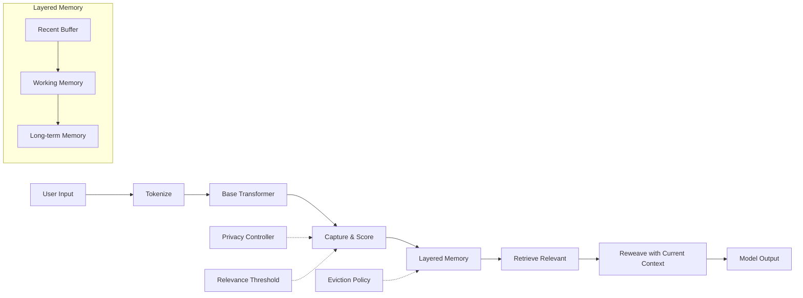

# Contextual Memory Reweaving (CMR) Project Initiative

**[Experimental]** *This project represents cutting-edge research in artificial intelligence memory systems and is currently in active development.*

## 🎯 Project Overview

The Contextual Memory Reweaving (CMR) project introduces a breakthrough approach to language model memory, inspired heavily by pioneering research by Frederick Dillon, Gregor Halvorsen, Simon Tattershall, Magnus Rowntree, and Gareth Vanderpool. Our goal is to create the next generation of AI memory systems that can remember and recall contextual information across conversations and tasks.

**Research Foundation:** *"Contextual Memory Reweaving in Large Language Models Using Layered Latent State Reconstruction"* - [CITE](https://arxiv.org/abs/2502.02046v1)

## 🚀 What We're Building

CMR represents a new category of AI memory that goes beyond traditional approaches. Instead of simple context windows, our system creates persistent, intelligent memory that:

- **Learns from Experience** - Captures and stores meaningful information from interactions
- **Recalls Contextually** - Retrieves relevant memories based on current conversation context  
- **Adapts Continuously** - Improves memory selection and quality over time
- **Scales Efficiently** - Handles large memory stores without performance degradation

## 🧠 How Memory Reweaving Works

Memory Reweaving is our breakthrough approach that enables AI systems to remember, recall, and intelligently use past information - similar to how human memory works, but with systematic organization and retrieval capabilities.

### The Core Concept

Traditional AI systems are like having a conversation with someone who has short-term memory loss - they can only remember what happened in the last few minutes. Memory Reweaving changes this by creating a persistent, intelligent memory system that captures important information and brings it back when relevant.

### The Four-Stage Process

#### 🎯 **Stage 1: Intelligent Capture**
The system automatically identifies and saves important information during interactions.

**Example**: During a customer service conversation about a billing issue:
- *Customer*: "I've been charged twice for my premium subscription this month"
- *System captures*: Customer has billing issue, double charge, premium subscription, current month

#### 🏪 **Stage 2: Smart Storage** 
Information is organized and stored with relevance scores and contextual tags.

**Example**: The billing issue gets stored with:
- *High relevance* (billing problems are critical)
- *Tags*: "billing", "subscription", "duplicate charge"
- *Context*: Customer account details, subscription tier, timeline

#### 🔍 **Stage 3: Contextual Retrieval**
When similar topics arise, the system searches for and ranks relevant memories.

**Example**: Three weeks later, the same customer mentions:
- *Customer*: "I want to upgrade my subscription"
- *System recalls*: Previous billing issue, subscription type, resolution steps
- *Relevance ranking*: Billing history (high), subscription preferences (medium)

#### 🔄 **Stage 4: Seamless Integration**
Past memories are woven into the current conversation naturally and appropriately.

**Example**: Response incorporating memory:
- *AI*: "I'd be happy to help with your upgrade. I see we resolved a billing issue for you recently - I'll make sure to double-check the charges are applied correctly for your new plan."

### Real-World Applications

#### **Customer Support Excellence**
**Scenario**: A customer calls about a software bug they reported months ago.

*Without Memory Reweaving*: "Can you please describe your issue from the beginning?"

*With Memory Reweaving*: "I see you're calling about the login issue you reported in March. Our development team released a fix in version 2.1.4. Have you updated your software?"

#### **Meeting Continuity**
**Scenario**: Weekly team meetings with ongoing projects.

*Without Memory Reweaving*: Each meeting starts from scratch, requiring lengthy recaps.

*With Memory Reweaving*: "Continuing from last week's discussion about the marketing campaign budget, I see we were waiting for approval on the $50K proposal. What's the latest update?"

#### **Document Analysis**
**Scenario**: Reviewing a complex legal contract with multiple related documents.

*Without Memory Reweaving*: Each document section is analyzed independently.

*With Memory Reweaving*: "This termination clause references the payment terms we discussed in Section 4.2, and it's consistent with the penalty structure mentioned in the addendum from February."

### What Makes It Intelligent

#### **Relevance Scoring**
Not all information is equally important. The system learns to identify:
- **Critical information**: Account issues, deadlines, decisions
- **Contextual details**: Preferences, past solutions, relationship history  
- **Background noise**: Casual conversation, irrelevant tangents

#### **Dynamic Prioritization**
Memory importance changes based on context:
- A customer's billing issue becomes highly relevant during payment discussions
- Project deadlines gain priority as dates approach
- Personal preferences surface during recommendation requests

#### **Quality Learning**
The system continuously improves by tracking:
- Which memories proved useful in conversations
- When recalled information enhanced outcomes
- How often specific memory types are accessed

### The Business Impact

#### **Enhanced Customer Experience**
- Customers feel heard and remembered
- Faster resolution times through historical context
- More personalized service based on past interactions

#### **Improved Efficiency**
- Reduced time spent on background gathering
- Fewer repeated questions and explanations
- Streamlined handoffs between team members

#### **Better Decision Making**
- Fuller context available for interactions
- Historical patterns inform current choices
- More consistent service across touchpoints

### Memory Reweaving vs. Traditional Approaches

| Traditional Systems                | Memory Reweaving                           |
| ---------------------------------- | ------------------------------------------ |
| "Start from the beginning"         | "Building on our previous conversation..." |
| Context limited to current session | Access to interaction history              |
| Manual note-taking required        | Automatic capture and organization         |
| Information silos                  | Connected, searchable knowledge base       |
| Reactive responses                 | Context-aware assistance                   |

This innovative approach transforms how AI systems interact with users, creating experiences that feel more natural, efficient, and intelligent - because the AI can remember and learn from interactions over time.

## 📊 Implementation Status

### ✅ **Completed Components**
| Component              | Status       | Description                               |
| ---------------------- | ------------ | ----------------------------------------- |
| Core Memory System     | 🟢 Complete | Foundation memory storage and retrieval   |
| Memory Reconstruction  | 🟢 Complete | Advanced memory integration capabilities  |
| Performance Monitoring | 🟢 Complete | Real-time system performance tracking     |
| Testing Framework      | 🟢 Complete | Comprehensive validation and benchmarking |

### 🔄 **In Development**
| Component           | Status      | Description                        |
| ------------------- | ----------- | ---------------------------------- |
| Advanced Retrieval  | 🟡 Partial | Enhanced memory search and ranking |
| Optimization Engine | 🟡 Partial | Automated performance tuning       |
| Integration Layer   | 🟡 Partial | Seamless model integration         |

### 📋 **Planned Features**
| Component            | Status      | Description                    |
| -------------------- | ----------- | ------------------------------ |
| Real-time Monitoring | 🔴 Planned | Live performance dashboards    |
| Health Diagnostics   | 🔴 Planned | Automated system health checks |
| Alert Systems        | 🔴 Planned | Proactive issue notification   |
| Advanced Analytics   | 🔴 Planned | Deep performance insights      |

## 🗺️ Development Roadmap

### **Phase 1: Foundation** *(Current)*
- ✅ Core memory architecture
- ✅ Basic retrieval mechanisms
- ✅ Performance testing framework
- 🔄 Integration with existing models

### **Phase 2: Enhancement** *(Next 3 months)*
- 🎯 Advanced memory search capabilities
- 🎯 Intelligent memory ranking
- 🎯 Automated optimization
- 🎯 Real-time monitoring dashboard

### **Phase 3: Scale** *(6-9 months)*
- 🎯 Production-ready deployment
- 🎯 Multi-model support
- 🎯 Enterprise integration
- 🎯 Advanced analytics suite

### **Phase 4: Innovation** *(9-12 months)*
- 🎯 Self-optimizing memory systems
- 🎯 Cross-conversation learning
- 🎯 Distributed memory architecture
- 🎯 Next-generation research features

## 🏗️ System Architecture

The CMR system is built with a modular architecture enabling rapid development and easy maintenance:

**Core Foundation**
- Memory Buffer - Intelligent storage management
- Reconstruction Engine - Advanced memory integration
- Hook System - Seamless model connectivity

**Intelligence Layer**
- Relevance Scoring - Smart memory prioritization
- Retrieval Engine - Context-aware memory search
- Optimization - Continuous performance improvement

**Operations Layer**
- Monitoring - Real-time performance insights
- Testing - Comprehensive validation
- Integration - Seamless deployment

## 📈 Success Metrics

**Performance Targets**
- Memory retrieval speed: < 10ms response time
- System efficiency: > 80% memory utilization
- Quality score: > 85% relevance accuracy

**Business Impact**
- Enhanced conversation quality through persistent memory
- Reduced computational overhead through intelligent caching
- Improved user experience with contextual awareness

## 🤝 Getting Involved

The CMR project represents the future of AI memory systems. We're building something that will fundamentally change how language models remember and learn.

**Current Focus Areas:**
- Performance optimization and scaling
- Real-time monitoring and diagnostics  
- Advanced retrieval and ranking algorithms
- Enterprise deployment preparation

---

*For technical implementation details, please refer to the comprehensive module documentation in the [`/docs`](docs/python) directory.*

*Last updated: August 2025*
