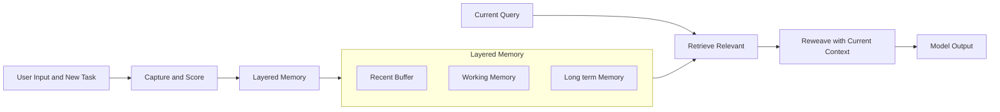
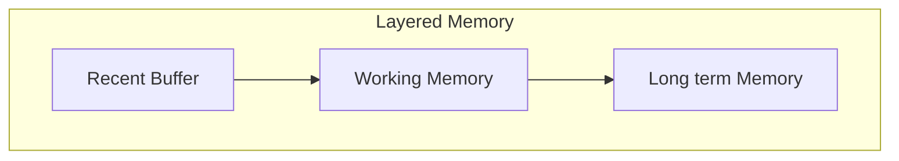
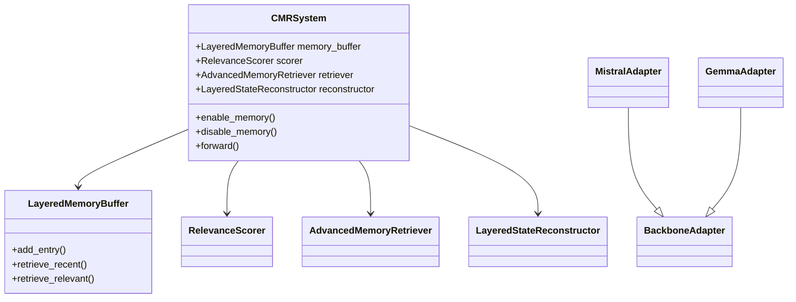

# CMR Python Documentation

Welcome to the documentation for the Contextual Memory Reweaving (CMR) Python implementation. This documentation provides comprehensive information about all modules, components, and functionality within the CMR system.

## Overview

## Table of Contents

- [Overview](#overview)
- [Key Features](#key-features)
- [Quick Start](#quick-start)
- [Architecture Overview](#architecture-overview)
- [Module Documentation](#module-documentation)
- [Getting Started](#getting-started)
- [Configuration Guide](#configuration-guide)
- [Performance Considerations](#performance-considerations)
- [Best Practices](#best-practices)
- [Troubleshooting](#troubleshooting)
- [Contributing](#contributing)
- [Version Information](#version-information)
- [License](#license)

The CMR system is a sophisticated memory-enhanced language model architecture that enables contextual memory reweaving for improved performance on long-context tasks. The system integrates advanced memory management, retrieval strategies, and optimization techniques with transformer-based language models.

## Key Features

- **Persistent Memory**: Long-term storage and retrieval of contextual information
- **Adaptive Retrieval**: Intelligent memory recall based on relevance and context
- **Layered Architecture**: Modular design for flexible integration with existing models
- **Performance Optimization**: Efficient memory management and computation
- **Model Agnostic**: Works with various transformer architectures
- **Extensible Design**: Easy to extend with custom components and strategies

## Memory Reweaving

Memory Reweaving helps a model remember and reuse the right pieces of past context at the right time—without forcing you to repeat yourself. Think of it like a well‑organized notebook for a digital assistant: it notices important details, files them neatly, and brings them back when they matter.

### What it is (in plain terms)

- **Selective memory**: The system keeps short highlights of what mattered in previous interactions instead of every word.
- **Layered storage**: Recent notes stay close by, important facts move to a more durable shelf, and rare but critical items go into long‑term storage.
- **Timely recall**: When you ask something new, CMR fetches only the most relevant notes and weaves them into the model’s thinking.

### Why this works

- Long chats and large documents overwhelm a model if we resend everything each time.
- Most details aren’t needed later—but the few that are can be decisive.
- CMR captures, scores, and retrieves those decisive details automatically.

### How it works (step by step)

1. Notice: While processing text, the system identifies potentially useful signals (facts, preferences, task steps).
2. Store: These signals are turned into compact entries and placed into a layered memory.
3. Score: Each entry is scored for relevance, recency, and usefulness.
4. Retrieve: For a new request, only top‑scoring, context‑matching entries are pulled back.
5. Reweave: Retrieved entries are blended with the current input to guide the response.
6. Maintain: Old or low‑value entries are pruned; important ones can be kept longer.

### Visual: Memory flow at a glance



### Visual: The memory layers



### Everyday examples

- Customer support assistant

  - Learns: your device type and subscription plan.
  - Reuses later: suggests the right troubleshooting steps automatically.
- Writing copilot

  - Learns: your project name and tone (e.g., “concise, friendly”).
  - Reuses later: drafts content in the same voice without reminders.
- Banking helper

  - Learns: your “every other Friday” payday and preferred transfer account.
  - Reuses later: when you say “schedule my usual transfer this week,” it proposes the right amount and account, asking only for confirmation.

### Advantages

- Personal continuity: Remembers preferences and prior decisions, reducing back‑and‑forth.
- Less repetition: You don’t need to restate context every time.
- Focused context: Sends only what’s relevant to the model, not the entire history.
- Better long‑task reliability: Maintains coherence over multi‑step workflows.
- Inspectable memory: Entries are structured and can be reviewed or pruned.
- Privacy controls: Sensitive items can be excluded or kept ephemeral.
- Model‑agnostic: Works alongside different transformer backbones.

### Controls you can enable

- Relevance thresholds: Only keep or recall entries above a chosen score.
- Eviction policies: Automatically clean up stale or low‑value entries.
- Retrieval budgets: Limit how many items can be pulled back per request.
- Opt‑out flags: Mark specific content as non‑persistent when needed.

### What to expect

- Fewer clarifying questions from the assistant.
- More consistent tone and intent across sessions.
- Improved accuracy on tasks that span many steps or documents.

## Quick Start

Minimal, offline-friendly setup using the lightweight transformer with hooks:

```python
from types import SimpleNamespace
import torch
from models import CMRTransformer

# Minimal config: only fields used by CMRTransformer are required
base_cfg = SimpleNamespace(vocab_size=50257, num_hidden_layers=8)

# Memory configuration
memory_config = {"target_layers": [2, 4], "buffer_size": 3}

# Create model and register hooks
cmr = CMRTransformer(config=base_cfg, memory_config=memory_config)
cmr.register_memory_hooks()
cmr.enable_memory()

# Run a tiny forward pass
input_ids = torch.randint(0, base_cfg.vocab_size, (1, 16))  # [batch=1, seq=16]
outputs = cmr(input_ids)

# Inspect memory stats
print(outputs["memory_stats"])  # {'total_captured_states': ..., 'layers_with_memory': [...]} 
```

## Architecture Overview



### Core Modules


| Module           | Description                              | Status            |
| ------------------ | ------------------------------------------ | ------------------- |
| **Models**       | Core neural networks and data structures | ✅ Active         |
| **Integration**  | System orchestration and coordination    | ✅ Active         |
| **Services**     | Advanced retrieval and processing        | 🔄 In Development |
| **Monitoring**   | Performance tracking and metrics         | ✅ Active         |
| **Optimization** | Performance enhancement                  | 🔄 In Development |
| **Utils**        | Infrastructure and helpers               | ✅ Active         |

## Module Documentation

### [Models Module](models/README.md)

The models module contains the core neural network models and data structures:

**Key Components:**

- **Base Transformer**: Enhanced transformer with memory capabilities
- **Memory Entry**: Core data structure for stored memories
- **Relevance Scorer**: Determines importance of hidden states
- **Advanced Retrieval**: Minimal top‑k retrieval today; advanced strategies planned
- **Performance Optimization**: Placeholder (stub); features planned
- **Integrated Models**: FullCMRModel is available; Integrated CMR Model planned

**Primary Use Cases:**

- Building memory-enhanced language models
- Implementing custom retrieval strategies
- Optimizing model performance
- Integrating with existing transformer architectures

### [Integration Module](integration/README.md)

The integration module provides system orchestration and coordination:

**Key Components:**

- **Integrated CMR Model** (Planned): Foundational CMR integration
- **Full CMR Model**: Complete CMR implementation
- **Mistral Integration**: Specialized Mistral model integration
- **Hook System**: Comprehensive hook management
- **Component Coordination**: Seamless component integration

**Primary Use Cases:**

- Deploying complete CMR systems
- Integrating CMR with existing models
- Coordinating multiple CMR components
- Production-ready CMR implementations

### [Experiments Module](experiments/README.md)

The experiments module provides comprehensive testing and analysis frameworks:

**Key Components:**

- **Dataset Testing**: Multi-dataset evaluation framework
- **Performance Analysis**: Detailed performance analysis tools
- **Benchmarking**: Comprehensive benchmarking capabilities
- **Visualization**: Results visualization and reporting
- **Comparative Analysis**: Cross-configuration comparisons

**Primary Use Cases:**

- Evaluating CMR performance
- Benchmarking different configurations
- Analyzing system behavior
- Generating performance reports

### [Monitoring Module](monitoring/README.md)

The monitoring module provides performance monitoring and metrics collection:

**Key Components:**

- **Performance Monitor**: Real-time performance tracking
- **Health Monitoring**: System health assessment
- **Metrics Collection**: Comprehensive metrics gathering
- **Diagnostic Tools**: System diagnostic capabilities
- **Alert System**: Performance alert mechanisms

**Primary Use Cases:**

- Monitoring system performance
- Tracking system health
- Collecting performance metrics
- Diagnosing system issues

### [Optimization Module](optimization/README.md)

The optimization module provides performance enhancement capabilities:

**Key Components:**

- **Adaptive Thresholds**: Dynamic threshold management
- **Batch Optimization**: Batch processing optimization
- **Memory Prefetching**: Predictive memory loading
- **Computation Scheduling**: Task scheduling optimization
- **Background Optimization**: Asynchronous optimization tasks

**Primary Use Cases:**

- Optimizing system performance
- Reducing computational overhead
- Improving memory efficiency
- Enhancing system responsiveness

### [Services Module](services/README.md)

The services module provides advanced retrieval and processing services:

**Key Components:**

- **Semantic Matching**: Content-based similarity services
- **Contextual Scoring**: Context-aware relevance assessment
- **Multi-criteria Ranking**: Sophisticated ranking systems
- **Memory Hierarchy**: Structured memory organization
- **Retrieval Caching**: Efficient caching services

**Primary Use Cases:**

- Implementing advanced retrieval strategies
- Building semantic matching systems
- Creating sophisticated ranking mechanisms
- Organizing memory hierarchically

### [Utils Module](utils/README.md)

The utils module provides infrastructure utilities and helper functions:

**Key Components:**

- **Hook Manager**: Comprehensive hook management
- **Memory Hierarchy**: Memory organization utilities
- **Retrieval Cache**: Caching utilities
- **Helper Functions**: Various utility functions
- **Configuration Management**: Configuration utilities

**Primary Use Cases:**

- Managing transformer hooks
- Organizing memory structures
- Implementing caching systems
- Providing utility functions

## Getting Started

### Quick Start Guide

1. **Installation**: Install required dependencies
2. **Basic Setup**: Initialize a basic CMR model
3. **Configuration**: Configure memory and retrieval settings
4. **Usage**: Process text with memory enhancement
5. **Monitoring**: Monitor performance and health

### Basic Usage Example

```python
from models.cmr_full_integrated import FullCMRModel
from transformers import AutoConfig, AutoTokenizer

# Create model configuration
# Note: Using remote configs (e.g., mistralai/...) requires network/HF access.
# For fully offline tests, pass a locally constructed config.
base_config = AutoConfig.from_pretrained("mistralai/Ministral-8B-Instruct-2410")

# Configure CMR settings
cmr_config = {
    'target_layers': [4, 8, 12],
    'max_entries_per_layer': 1000,
    'scoring_method': 'hybrid',
    'retrieval_strategy': 'multi_criteria'
}

# Initialize CMR model
model = FullCMRModel(base_config, cmr_config)

# Create tokenizer and process input with memory
tokenizer = AutoTokenizer.from_pretrained("mistralai/Ministral-8B-Instruct-2410")
input_ids = tokenizer.encode("Your input text here", return_tensors="pt")
outputs = model.forward(input_ids, return_memory_info=True)

# Access results and memory information
generated_states = outputs['last_hidden_state']
memory_stats = {k: outputs[k] for k in ("memory_stats", "performance_stats", "retrieval_stats") if k in outputs}
```

Note: The quickstart example uses Hugging Face model names and will require access. There is no automatic fallback to GPT‑2 in tokenization. `FullCMRModel` projects `last_hidden_state` to a 256‑dimensional hidden size by default for consistency in tests.

## Configuration Guide

### Basic Configuration

```python
# Memory configuration
memory_config = {
    'target_layers': [4, 8, 12],          # Layers to capture from
    'max_entries_per_layer': 1000,        # Buffer size per layer
    'scoring_method': 'hybrid',           # Relevance scoring method
    'relevance_threshold': 0.5,           # Minimum relevance score
    'eviction_strategy': 'lru_relevance'  # Memory eviction strategy
}

# Retrieval configuration
retrieval_config = {
    'strategy': 'multi_criteria',         # Retrieval strategy
    'similarity_threshold': 0.7,          # Similarity threshold
    'context_heads': 8,                   # Contextual scorer heads
    'cache_size': 1000,                   # Retrieval cache size
    'max_clusters': 32,                   # Hierarchical clustering granularity
    'criteria_weights': {                 # Multi-criteria weights
        'relevance': 0.4,
        'similarity': 0.3,
        'recency': 0.2,
        'diversity': 0.1
    }
}

# Memory selection count is controlled at call time via RetrievalContext.retrieval_budget

# Optimization configuration
optimization_config = {
    'enable_adaptive_thresholds': True,   # Enable adaptive thresholds
    'enable_batch_optimization': True,    # Enable batch optimization
    'enable_prefetching': True,           # Enable memory prefetching
    'enable_background_optimization': True # Enable background tasks
}
```

### Advanced Configuration

For advanced configuration options, refer to the individual module documentation. Note that `IntegratedCMRModel` is planned and not available; `FullCMRModel` defaults to `attention_based` relevance scoring.

## Performance Considerations

### Memory Management

- **Buffer Sizing**: Configure appropriate buffer sizes for your use case
- **Eviction Strategies**: Choose optimal eviction policies
- **Memory Monitoring**: Monitor memory usage continuously
- **Cleanup Procedures**: Implement regular cleanup routines

### Computational Efficiency

- **Batch Processing**: Optimize batch sizes for throughput
- **Caching**: Implement effective caching strategies
- **Prefetching**: Use predictive loading for better performance
- **Background Processing**: Leverage asynchronous operations

### Hardware Optimization

- **GPU Utilization**: Optimize for GPU acceleration
- **Memory Allocation**: Efficient memory allocation strategies
- **Quantization**: Use appropriate precision for your hardware
- **Device Management**: Optimize device placement and usage

## Best Practices

### Development

1. **Modular Design**: Use modular architecture principles
2. **Configuration Management**: Use comprehensive configuration systems
3. **Error Handling**: Implement robust error handling
4. **Testing**: Write comprehensive tests for all components

### Deployment

1. **Performance Monitoring**: Implement comprehensive monitoring
2. **Resource Management**: Manage system resources effectively
3. **Scaling**: Design for horizontal and vertical scaling
4. **Maintenance**: Plan for system maintenance and updates

### Optimization

1. **Profiling**: Profile your specific use case regularly
2. **Tuning**: Iteratively tune system parameters
3. **Monitoring**: Monitor optimization impact continuously
4. **Validation**: Validate performance improvements

## Troubleshooting

### Common Issues

- **Memory Errors**: Reduce buffer sizes or optimize memory usage
- **Performance Issues**: Enable optimization features and tune parameters
- **Integration Problems**: Check component compatibility and configuration
- **Resource Conflicts**: Monitor and manage resource usage

### Getting Help

- **Documentation**: Refer to module-specific documentation
- **Examples**: Check demo scripts and usage examples
- **Configuration**: Validate configuration parameters
- **Monitoring**: Use monitoring tools to diagnose issues

## Contributing

### Development Guidelines

1. **Code Style**: Follow established code style guidelines
2. **Documentation**: Document all new features and changes
3. **Testing**: Write tests for new functionality
4. **Performance**: Consider performance impact of changes

### Module Structure

When adding new functionality:

1. Choose the appropriate module for your changes
2. Follow existing patterns and conventions
3. Update documentation accordingly
4. Add appropriate tests and examples

## Version Information

This documentation covers the current version of the CMR system. For version-specific information and changelog, refer to the project repository.

## License

This project is licensed under the terms specified in the project repository.
