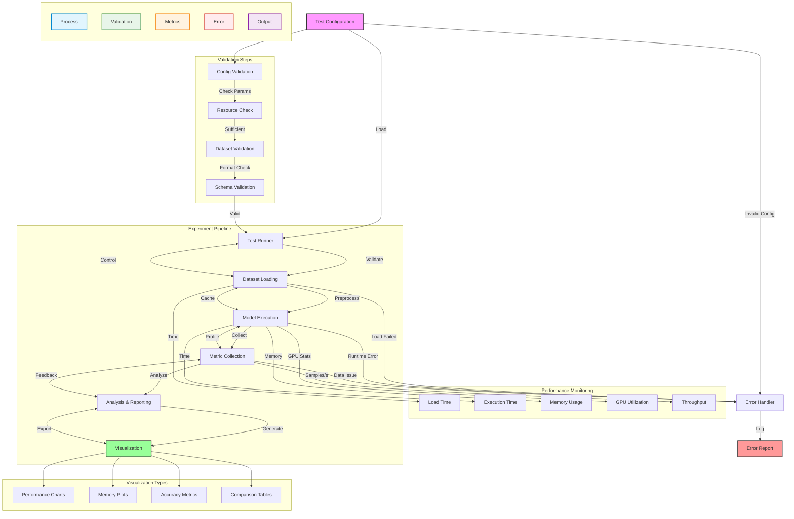

# Experiments Module

The experiments module contains comprehensive testing and analysis frameworks for the Contextual Memory Reweaving (CMR) system. This module provides tools for evaluating CMR performance across different datasets, analyzing computational overhead, and benchmarking various system configurations.

## Overview

## Table of Contents

- [Overview](#overview)
- [Key Components](#key-components)
- [Demo Scripts](#demo-scripts)
- [Configuration](#configuration)
- [Output and Results](#output-and-results)
- [Integration with CMR System](#integration-with-cmr-system)
- [Best Practices](#best-practices)
- [Troubleshooting](#troubleshooting)



The experiments module is designed to validate and analyze the CMR system's performance in real-world scenarios. It includes dataset testing capabilities, performance analysis tools, and comprehensive benchmarking frameworks.

### Experiment Workflow

1. **Test Configuration**: Define experiment parameters and test cases
2. **Test Runner**: Orchestrates the execution of experiments
3. **Dataset Loading**: Loads and preprocesses test datasets
4. **Model Execution**: Runs CMR model with test inputs
5. **Metric Collection**: Gathers performance and accuracy metrics
6. **Analysis & Reporting**: Processes and analyzes results
7. **Visualization**: Generates visual reports and comparisons

## Key Components

### Dataset Testing (`dataset_testing.py`)

[View Class Documentation](./dataset_testing.md)

The `CMRDatasetTester` class provides comprehensive testing capabilities across multiple dataset types:

**Supported Dataset Types:**

- **Conversation**: Multi-turn dialogue testing
- **Long Context**: Extended sequence processing evaluation
- **Question Answering**: QA task performance analysis
- **Summarization**: Text summarization capabilities
- **Code Generation**: Programming task evaluation

**Key Features:**

- Automated test execution across multiple datasets
- Memory behavior analysis during testing
- Performance metrics collection and aggregation
- Comparative analysis between different configurations
- Visualization generation for results

**Usage Example:**

```python
from experiments.dataset_testing import CMRDatasetTester

# Initialize tester
tester = CMRDatasetTester(cmr_model, tokenizer, test_config)

# Run comprehensive tests
results = tester.run_comprehensive_tests(dataset_configs, output_dir)
```

### Performance Analysis (`performance_analysis.py`)

[View Class Documentation](./performance_analysis.md)

The `CMRPerformanceAnalyzer` class provides detailed performance analysis capabilities:

**Analysis Types:**

- **Computational Overhead**: CPU/GPU usage analysis
- **Memory Efficiency**: Memory consumption patterns
- **Scalability Analysis**: Performance across different sequence lengths
- **Layer-wise Impact**: Per-layer performance breakdown
- **Retrieval Strategy Comparison**: Benchmarking different retrieval methods
- **Reconstruction Method Comparison**: Evaluating reconstruction approaches
- **Memory Buffer Analysis**: Buffer behavior and efficiency
- **Real-time Performance**: Live performance monitoring

**Key Metrics:**

- Forward pass timing
- Memory usage patterns
- Retrieval efficiency
- Reconstruction quality
- Cache performance: cache_hits and cache_misses (rate calculation planned)
- Eviction patterns

**Usage Example:**

```python
from experiments.performance_analysis import CMRPerformanceAnalyzer

# Initialize analyzer
analyzer = CMRPerformanceAnalyzer(cmr_model)

# Run comprehensive analysis
results = analyzer.run_comprehensive_analysis(output_dir)
```

## Demo Scripts

### Dataset Testing Demo (`demo_day9_dataset_testing.py`)

Demonstrates the dataset testing framework with:

- Mock dataset creation
- Multi-dataset testing execution
- Results analysis and visualization
- Performance metrics collection

### Performance Analysis Demo (`demo_day10_performance_analysis.py`)

Showcases performance analysis capabilities including:

- Computational overhead analysis
- Memory efficiency evaluation
- Scalability testing
- Strategy comparison benchmarks

## Configuration

### Test Configuration Structure

```python
test_config = {
    'enable_optimization': True,
    'optimization_config': {
        'enable_prefetching': True,
        'enable_batch_optimization': True
    }
}
```

### Dataset Configuration Structure

```python
dataset_config = {
    'name': 'conversation_test',
    'type': 'conversation',
    'max_length': 512,
    'max_samples': 50,
    'batch_size': 4,
    'test_config': {
        'enable_memory': True,
        'enable_reconstruction': True
    }
}
```

## Output and Results

### Generated Files

The experiments module generates comprehensive output including:

- **JSON Reports**: Detailed metrics and analysis results
- **Visualizations**: Performance charts and trend analysis
- **CSV Data**: Raw metrics for further analysis
- **Summary Reports**: High-level findings and recommendations
- **Performance Summary CSV**: `performance_summary.csv` generated by the analyzer

### Metrics Collected

- **Performance Metrics**: Timing, throughput, latency
- **Memory Metrics**: Usage patterns, efficiency, eviction rates
- **Quality Metrics**: Reconstruction quality, retrieval accuracy
- **System Metrics**: Resource utilization, cache performance

## Integration with CMR System

The experiments module integrates seamlessly with:

- **FullCMRModel**: Complete system testing
- **Memory Buffer**: Buffer behavior analysis
- **Retrieval System**: Strategy evaluation
- **Reconstruction System**: Method comparison
- **Performance Optimization**: Optimization impact analysis

## Best Practices

1. **Test Configuration**: Use appropriate batch sizes and sequence lengths for your hardware
2. **Dataset Selection**: Choose representative datasets for your use case
3. **Metric Interpretation**: Focus on metrics most relevant to your application
4. **Resource Management**: Monitor system resources during long-running tests
5. **Result Analysis**: Compare results across different configurations systematically

## Troubleshooting

### Common Issues

- **Memory Errors**: Reduce batch size or sequence length
- **Slow Performance**: Enable optimization features
- **Missing Dependencies**: Ensure all required packages are installed
- **Dataset Loading**: Verify dataset paths and formats

### Performance Tips

- Use GPU acceleration when available
- Enable batch optimization for better throughput
- Configure appropriate memory limits
- Use caching for repeated experiments
