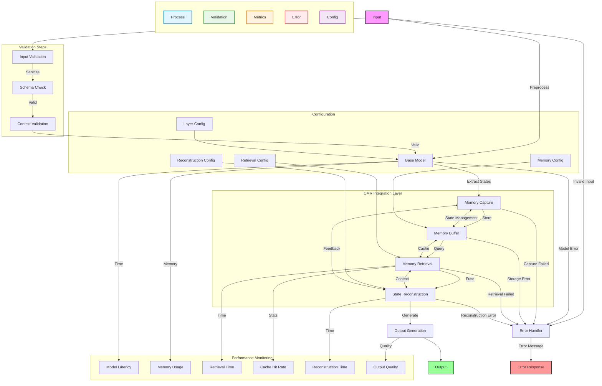

# Integration Module

The integration module provides system orchestration and integration functionality for the Contextual Memory Reweaving (CMR) system. This module contains the main integrated models that coordinate all CMR components and provide end-to-end memory functionality.

## Overview

## Table of Contents

- [Overview](#overview)
- [Integration Flow](#integration-flow)
- [Key Components](#key-components)
- [Integration Architecture](#integration-architecture)
- [Configuration](#configuration)
- [Performance Features](#performance-features)
- [Testing and Validation](#testing-and-validation)
- [Best Practices](#best-practices)
- [Troubleshooting](#troubleshooting)



The integration module serves as the central coordination layer for the CMR system, bringing together memory management, retrieval, reconstruction, and optimization components into cohesive, production-ready models.

### Integration Flow

1. **Input Processing**: Raw input is processed by the base model
2. **Memory Capture**: Relevant states are captured from specified layers
3. **Memory Storage**: Captured states are stored in the memory buffer
4. **Memory Retrieval**: Relevant memories are retrieved based on current context
5. **State Reconstruction**: Retrieved memories are integrated with current state
6. **Output Generation**: Final output is generated with memory context

### Configuration Management

- **Layer Configuration**: Controls which layers capture and use memory
- **Memory Configuration**: Manages buffer sizes and storage parameters
- **Retrieval Configuration**: Defines retrieval strategies and parameters
- **Reconstruction Configuration**: Controls how memories are integrated

## Key Components

### Integrated CMR Model (Planned)

[View Planned Implementation Details](./integrated_cmr_model.md)

This component is planned and not present in the current codebase. For end-to-end integration today, use FullCMRModel (`cmr_full_integrated.py`) as the entry point.

Example:

```python
from models.cmr_full_integrated import FullCMRModel

model = FullCMRModel(base_config, cmr_config)
outputs = model.forward(input_ids, return_memory_info=True)
```

### Full CMR Model (`cmr_full_integrated.py`)

[View Class Documentation](./cmr_full_integrated.md)

The `FullCMRModel` class provides the current end-to-end CMR implementation. Several advanced features are planned but not yet implemented.

**Current Components:**

- **Memory Buffer**: LayeredMemoryBuffer for storage and simple retrieval (top‑k by relevance)
- **Reconstruction Integrator**: LayeredStateReconstructor for state blending
- **Basic Performance Stats**: performance_stats dict surfaced in outputs

**Planned Enhancements:**

- **Advanced Memory Retriever**: Multiple retrieval strategies
- **Dedicated Performance Monitor**: Rich metrics and dashboards
- **Optimization Layer**: Adaptive performance optimization

**Notes on Retrieval:** Strategy names listed below are placeholders; current behavior retrieves top‑k relevant entries per layer.

**Usage Example:**

```python
from models.cmr_full_integrated import FullCMRModel

# Initialize full model
model = FullCMRModel(base_config, cmr_config)

# Process with advanced features
outputs = model.forward(input_ids, return_memory_info=True)
```

### Mistral Integration (`mistral_integration.py`)

[View Class Documentation](./mistral_integration.md)

### Management API (Current)

[View API Documentation](./management_api.md)

For method details, see Models module: FullCMRModel Management API

- Link: ../models/README.md#fullcmrmodel-management-api-current

Common operations you can call on FullCMRModel:

- Enable/disable memory: model.enable_memory(True/False)
- Enable/disable reconstruction: model.enable_reconstruction(True/False)
- Set retrieval strategy (placeholder today): model.set_retrieval_strategy(name)
- Set reconstruction method: model.set_reconstruction_method(name)
- Optimize memory buffer: model.optimize_memory()
- Persist/restore memory: model.save_memory(path), model.load_memory(path)
- Forward pass options: return_memory_info, return_layer_outputs

The `MistralCMRModel` class provides specialized integration with Mistral models:

**Mistral-Specific Features:**

- Optimized for Mistral architecture
- 8-bit quantization support (environment-dependent)
- Device selection via HF settings
- Enhanced memory configuration
- Mistral-specific performance optimizations (varies by hardware/backends)

**Usage Example:**

```python
from models.mistral_integration import create_mistral_cmr_model

# Create Mistral CMR model
model = create_mistral_cmr_model(
    model_name="mistralai/Ministral-8B-Instruct-2410",
    use_quantization=True,
    device="auto"
)
```

## Integration Architecture

### Component Orchestration

The integration module coordinates the following components:

```text
FullCMRModel
├── Base Transformer (Mistral/GPT)
├── Memory Components
│   ├── LayeredMemoryBuffer
│   ├── RelevanceScorer
│   └── AdvancedMemoryRetriever (Planned)
├── Reconstruction System
│   ├── LayeredStateReconstructor
│   ├── ReconstructionIntegrator (Planned)
│   └── ContextBlender (Planned)
├── Optimization Layer (Planned)
│   ├── AdaptiveThresholdManager
│   ├── BatchProcessingOptimizer
│   ├── MemoryPrefetcher
│   └── BackgroundOptimizer
└── Monitoring System (Planned)
    ├── CMRPerformanceMonitor
    └── HookManager
```

### Hook System Integration

The integration module manages sophisticated hook systems for:

**Capture Hooks:**

- Hidden state extraction at target layers
- Attention pattern capture
- Gradient flow monitoring

**Intervention Hooks:**

- Memory-enhanced state injection
- Reconstruction integration
- Adaptive threshold application

## Configuration

### Memory Configuration

```python
memory_config = {
    'target_layers': [2, 4, 6],           # Layers to capture from
    'intervention_layers': [4, 6],        # Layers to inject memory
    'max_entries_per_layer': 1000,        # Buffer size per layer
    'max_total_entries': 5000,            # Total buffer size
    'scoring_method': 'hybrid',           # Relevance scoring method
    'relevance_threshold': 0.5,           # Minimum relevance score
    'eviction_strategy': 'lru_relevance', # Memory eviction strategy
    'retrieval_strategy': 'multi_criteria' # Memory retrieval method
}
```

### Retrieval Configuration

```python
retrieval_config = {
    'similarity_threshold': 0.7,
    'context_heads': 8,
    'criteria_weights': {
        'relevance': 0.4,
        'similarity': 0.3,
        'recency': 0.2,
        'diversity': 0.1
    }
}
```

Note: The number of memories considered is controlled at retrieval time via `RetrievalContext.retrieval_budget`.

### Reconstruction Configuration

```python
reconstruction_config = {
    'method': 'hierarchical',
    'integration_method': 'weighted_sum',
    'memory_weight': 0.3,
    'max_memory_tokens': 128,
    'compression_ratio': 0.6
}
```

## Performance Features

### Adaptive Optimization

- **Dynamic Thresholds**: Automatically adjust relevance thresholds
- **Batch Optimization**: Optimize input batching for efficiency
- **Memory Prefetching**: Predictive memory loading
- **Background Processing**: Asynchronous optimization tasks

### Monitoring and Diagnostics

- **Real-time Metrics**: Live performance tracking
- **Health Monitoring**: System health assessment
- **Resource Usage**: Memory and compute utilization
- **Error Handling**: Comprehensive error recovery

## Testing and Validation

### Integration Tests

The module includes comprehensive integration tests:

- **Component Integration**: Verify all components work together
- **End-to-End Workflows**: Test complete processing pipelines
- **Performance Validation**: Ensure performance targets are met
- **Error Handling**: Test error recovery mechanisms

### Demo Scripts

- **Basic Integration Demo**: `demo_day8_integration.py`
- **Mistral Integration Demo**: `demo_mistral_integration.py`
- See also tests in `python/tests/test_week2_integration.py` for a comprehensive system demonstration

## Best Practices

### Model Initialization

1. **Configuration Validation**: Ensure all configurations are valid
2. **Device Management**: Properly handle device placement
3. **Memory Allocation**: Configure appropriate buffer sizes
4. **Hook Registration**: Verify hooks are properly registered

### Performance Optimization

1. **Target Layer Selection**: Choose layers strategically
2. **Threshold Tuning**: Optimize relevance thresholds
3. **Batch Size Optimization**: Balance memory and throughput
4. **Caching Strategy**: Use appropriate caching mechanisms

### Error Handling

1. **Graceful Degradation**: Handle component failures gracefully
2. **Resource Monitoring**: Monitor system resources
3. **Cleanup Procedures**: Ensure proper cleanup on shutdown
4. **Logging**: Implement comprehensive logging

## Troubleshooting

### Common Issues

- **Memory Overflow**: Reduce buffer sizes or increase eviction frequency
- **Hook Conflicts**: Ensure hooks don't interfere with each other
- **Performance Degradation**: Check optimization settings
- **Model Loading**: Verify model access and authentication

### Performance Tips

- Use appropriate quantization for your hardware
- Configure memory buffers based on available RAM
- Enable background optimization for long-running tasks
- Monitor system resources during operation
