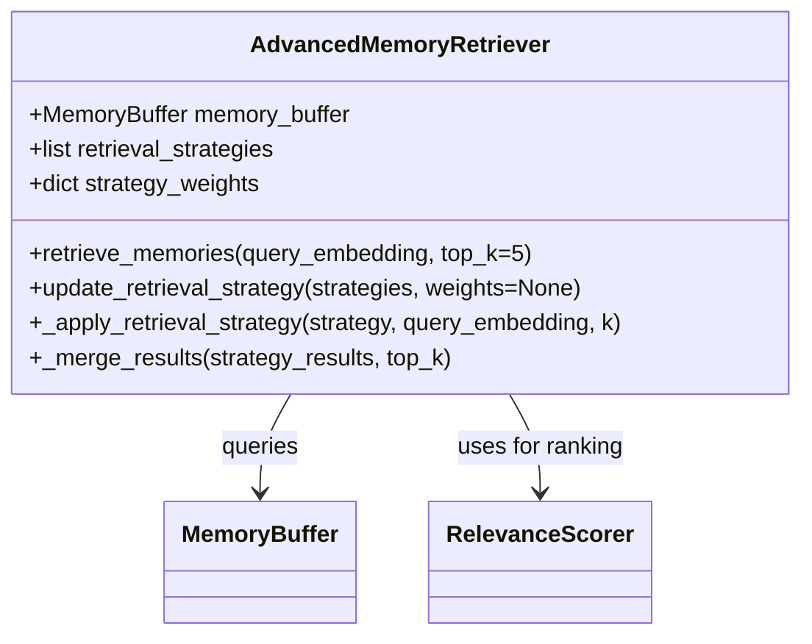

# AdvancedMemoryRetriever

## Overview

`AdvancedMemoryRetriever` is a sophisticated memory retrieval system that implements multiple strategies for finding and ranking relevant memories in the CMR system. It works in conjunction with the memory buffer to provide contextually appropriate memories for the current task.

## Key Features

- Multi-strategy memory retrieval
- Configurable ranking algorithms
- Support for hybrid retrieval methods
- Efficient similarity search
- Integration with various memory backends

## Architecture



## Usage Example

```python
from models.retrieval import AdvancedMemoryRetriever
import torch

# Initialize with memory buffer
memory_buffer = get_memory_buffer()  # Get initialized memory buffer
retriever = AdvancedMemoryRetriever(
    memory_buffer=memory_buffer,
    retrieval_strategies=['semantic', 'temporal', 'frequency'],
    strategy_weights={
        'semantic': 0.6,
        'temporal': 0.25,
        'frequency': 0.15
    }
)

# Retrieve relevant memories
query_embedding = get_current_embedding()  # Get embedding for current context
relevant_memories = retriever.retrieve_memories(
    query_embedding=query_embedding,
    top_k=5
)

# Update retrieval strategy dynamically
retriever.update_retrieval_strategy(
    strategies=['semantic', 'recency'],
    weights={'semantic': 0.7, 'recency': 0.3}
)
```

## Core Methods

- `retrieve_memories(query_embedding, top_k=5)`: Retrieves top-k relevant memories
- `update_retrieval_strategy(strategies, weights=None)`: Updates the retrieval approach
- `_apply_retrieval_strategy(strategy, query_embedding, k)`: Internal method for strategy application
- `_merge_results(strategy_results, top_k)`: Combines results from multiple strategies

## Retrieval Strategies

1. **Semantic Search**: Finds memories with similar content
2. **Temporal Proximity**: Prioritizes recent memories
3. **Frequency-Based**: Favors frequently accessed memories
4. **Recency-Frequency Hybrid**: Balances recency and access frequency
5. **Diversity-Aware**: Ensures diverse memory selection

## Configuration

Configure using the following parameters:

- `memory_buffer`: The memory buffer to search through
- `retrieval_strategies`: List of strategies to use
- `strategy_weights`: Relative importance of each strategy
- `similarity_metric`: Distance metric for semantic search
- `diversity_penalty`: Controls diversity in results

## Best Practices

- Balance between different retrieval strategies
- Monitor retrieval performance metrics
- Consider caching frequent queries
- Implement incremental updates for large memory buffers
- Profile and optimize for your specific workload
