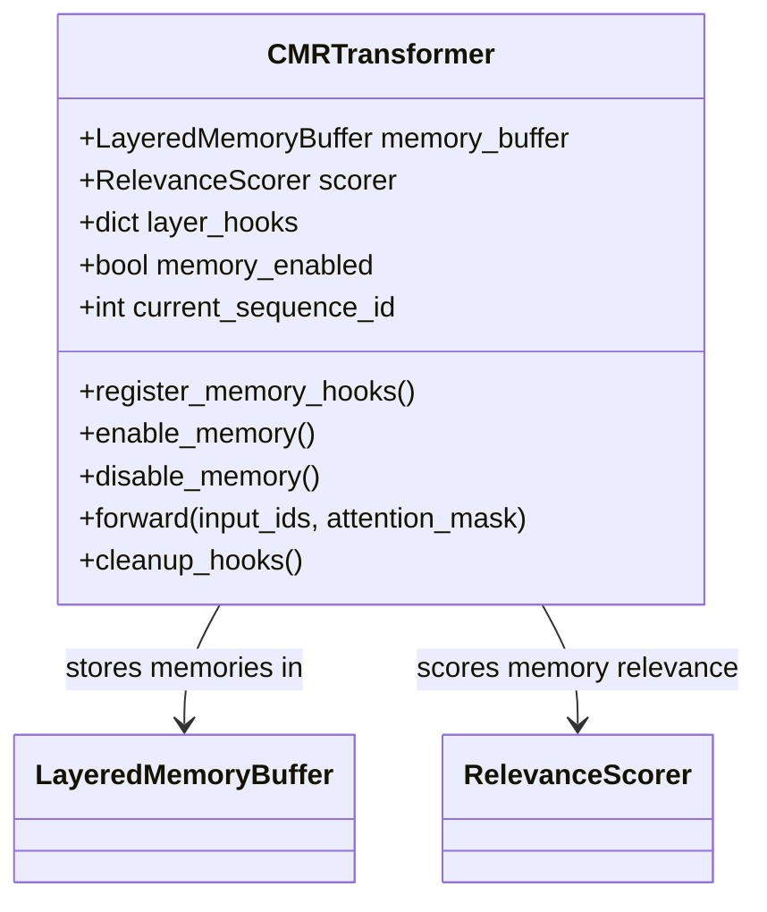

# CMRTransformer

## Overview
`CMRTransformer` is the foundational class for memory-enhanced transformer models in the CMR system. It extends standard transformer architectures with memory capture and integration capabilities, enabling contextual memory reweaving during inference.

## Key Features
- **Memory Integration**: Captures and retrieves hidden states during forward passes
- **Hook System**: Configurable hooks for state capture at different layers
- **Device Management**: Automatic handling of CPU/GPU/TPU devices
- **Quantization Support**: Model optimization through quantization
- **Sequence Tracking**: Manages sequence IDs and positions

## Architecture


## Usage Example
```python
from models.base_transformer import CMRTransformer
from transformers import AutoConfig

# Initialize with config
config = AutoConfig.from_pretrained("mistralai/Ministral-8B-Instruct-2410")
memory_config = {
    'target_layers': [2, 4, 6],  # Layers to capture
    'buffer_size': 100,          # Max entries per layer
    'relevance_threshold': 0.5   # Minimum relevance score
}

# Initialize model
model = CMRTransformer(config, memory_config=memory_config)

# Enable memory capture
model.enable_memory()

# Forward pass with memory integration
outputs = model(input_ids, attention_mask=attention_mask)
```

## Core Methods
- `register_memory_hooks()`: Sets up hooks for capturing hidden states
- `enable_memory()`: Activates memory capture and integration
- `disable_memory()`: Deactivates memory operations
- `forward(input_ids, attention_mask)`: Processes input with memory integration
- `cleanup_hooks()`: Removes all registered hooks

## Configuration
Configure using the `memory_config` dictionary with parameters for:
- `target_layers`: List of layer indices to capture
- `buffer_size`: Maximum number of memory entries per layer
- `relevance_threshold`: Minimum score for memory retention
- `device`: Target device for computation

## Integration
- Works with Hugging Face's transformer models
- Supports custom memory buffers and scorers
- Compatible with model parallelism
