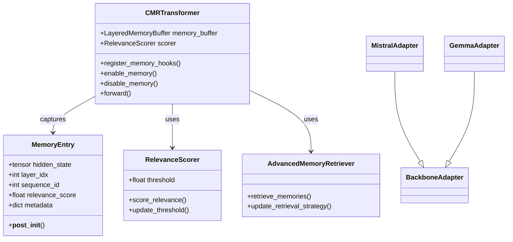
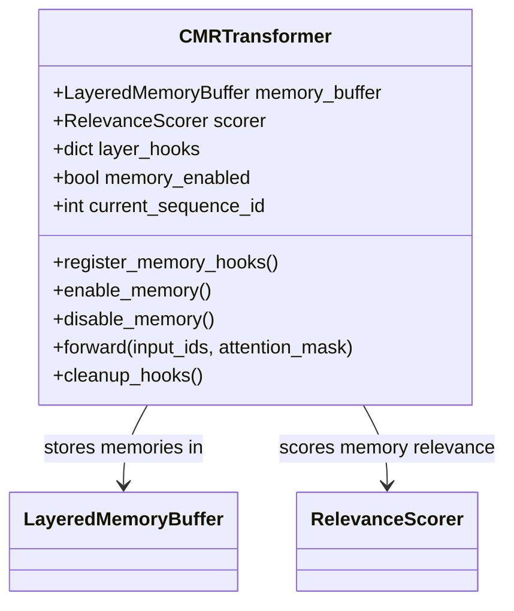
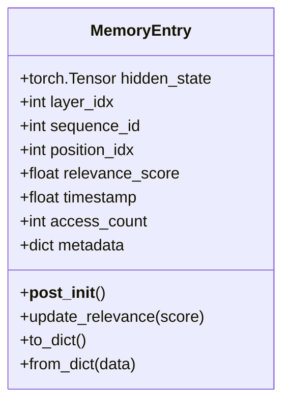
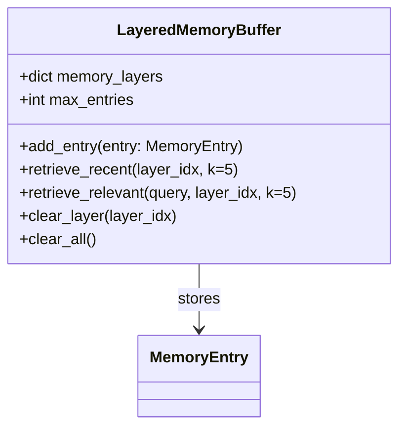
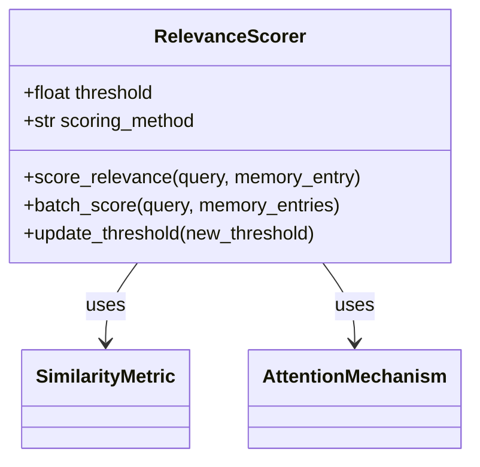
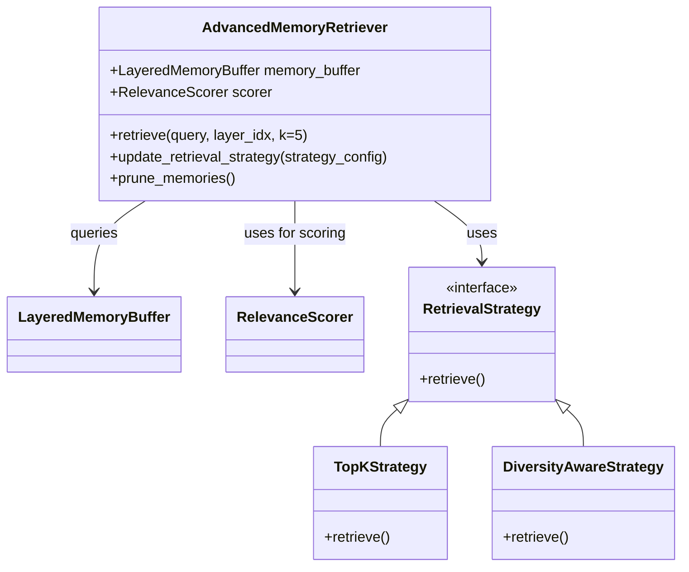

# Models Module

The models module contains the core neural network models and data structures for the Contextual Memory Reweaving (CMR) system. This module provides the fundamental building blocks for memory-enhanced language models.

## Overview

## Table of Contents

- [Overview](#overview)
- [Class Relationships](#class-relationships)
- [Core Components](#core-components)
- [Performance Considerations in Memory Management](#performance-considerations-in-memory-management)
- [Integration Guide](#integration-guide)
- [Troubleshooting](#troubleshooting)
- [API Reference](#api-reference)
- [CMRTransformer Best Practices](#cmrtransformer-best-practices)
- [Integrated Models](#integrated-models)
- [Data Models and Structures](#data-models-and-structures)
- [Configuration Patterns](#configuration-patterns)
- [Performance Considerations](#performance-considerations)
- [Best Practices](#best-practices)
- [CMRTransformer Troubleshooting](#cmrtransformer-troubleshooting)

The models module implements the core neural network architectures and data models that enable contextual memory reweaving. It includes base transformers, specialized model variants, relevance scoring networks, and essential data structures.

## Class Relationships



## Core Components

### 1. Base Transformer (`base_transformer.py`)

[View Class Documentation](./base_transformer.md)

The `CMRTransformer` class is the foundation for memory-enhanced transformers, providing memory capture and integration capabilities.

#### Key Features

- **Memory Integration**: Captures and retrieves hidden states during forward passes
- **Hook System**: Configurable hooks for state capture at different layers
- **Device Management**: Automatic handling of CPU/GPU/TPU devices
- **Quantization**: Support for model optimization through quantization
- **Sequence Tracking**: Manages sequence IDs and positions

#### Architecture



#### Usage Example

```python
from models.base_transformer import CMRTransformer
from transformers import AutoConfig

# Initialize with config
config = AutoConfig.from_pretrained("mistralai/Ministral-8B-Instruct-2410")
memory_config = {
    'target_layers': [2, 4, 6],  # Layers to capture
    'buffer_size': 100,          # Max entries per layer
    'relevance_threshold': 0.5   # Minimum relevance score
}

# Initialize model
model = CMRTransformer(config, memory_config=memory_config)

# Enable memory and register hooks
model.enable_memory()
model.register_memory_hooks()

# Process input (example)
input_ids = tokenizer("Your input here", return_tensors="pt").input_ids
outputs = model(input_ids)
```

### 2. Memory Management

#### MemoryEntry (`memory_entry.py`)

[View Class Documentation](./memory_entry.md)

The `MemoryEntry` class is the fundamental data structure for storing and managing memory states.



**Attributes:**

- `hidden_state` (torch.Tensor): The stored tensor representation
- `layer_idx` (int): Transformer layer index where the state was captured
- `sequence_id` (int): Identifier for the input sequence
- `position_idx` (int): Position within the sequence
- `relevance_score` (float): Computed relevance score (0-1)
- `timestamp` (float): Unix timestamp of creation
- `access_count` (int): Number of times this memory was retrieved
- `metadata` (dict): Additional context or metadata

**Key Methods:**

- `update_relevance(score)`: Update the relevance score
- `to_dict()`: Convert to dictionary for serialization
- `from_dict(data)`: Create instance from dictionary

#### LayeredMemoryBuffer (`memory_buffer.py`)

[View Class Documentation](./memory_buffer.md)

Manages storage and retrieval of memory entries with layer-specific organization.



**Features:**

- Layer-specific memory organization
- Configurable maximum entries per layer
- Efficient retrieval by recency or relevance
- Thread-safe operations

### 3. Relevance Scoring

#### RelevanceScorer (`relevance_scorer.py`)

[View Class Documentation](./relevance_scorer.md)

The `RelevanceScorer` class evaluates the importance of memory entries based on various criteria.



**Scoring Methods:**

1. **Cosine Similarity**: Measures angular distance between query and memory
2. **Dot Product**: Computes dot product of query and memory vectors
3. **Attention-Based**: Uses multi-head attention for contextual scoring
4. **Hybrid**: Combines multiple scoring methods

**Usage Example:**

```python
from models.relevance_scorer import RelevanceScorer
import torch

# Initialize scorer
scorer = RelevanceScorer(
    hidden_size=4096,
    scoring_method='attention',
    threshold=0.5
)

# Score a single memory
query = torch.randn(1, 4096)
memory = torch.randn(1, 4096)
score = scorer.score_relevance(query, memory)

# Batch scoring
queries = torch.randn(10, 4096)
memories = torch.randn(20, 4096)
scores = scorer.batch_score(queries, memories)
```

### 4. Advanced Retrieval

#### AdvancedMemoryRetriever (`advanced_retrieval.py`)

[View Class Documentation](./advanced_retriever.md)

Manages sophisticated memory retrieval strategies with multiple criteria.



**Retrieval Strategies:**

1. **Top-K**: Returns most relevant memories
2. **Diversity-Aware**: Ensures diverse memory selection
3. **Recency-Weighted**: Favors recent memories
4. **Hybrid**: Combines multiple strategies

**Usage Example:**

```python
from models.advanced_retriever import AdvancedMemoryRetriever

# Initialize retriever with memory buffer and scorer
retriever = AdvancedMemoryRetriever(
    memory_buffer=memory_buffer,
    scorer=relevance_scorer,
    strategy='hybrid'
)

# Configure retrieval strategy
retriever.update_retrieval_strategy({
    'method': 'hybrid',
    'weights': {
        'relevance': 0.6,
        'recency': 0.3,
        'diversity': 0.1
    }
})

# Retrieve relevant memories
query = get_current_hidden_state()
relevant_memories = retriever.retrieve(
    query=query,
    layer_idx=4,
    k=5
)

## Performance Considerations in Memory Management

### Memory Management Performance Considerations

- **Batch Processing**: Process memories in batches for efficiency
- **Quantization**: Use lower precision (FP16/BF16) for memory efficiency
- **Pruning**: Regularly remove low-relevance memories
- **Caching**: Cache frequently accessed memories

### Optimization Tips

1. **Layer Selection**: Only capture from critical layers
2. **Threshold Tuning**: Adjust relevance thresholds based on task
3. **Batch Sizing**: Optimize batch size for your hardware
4. **Asynchronous Processing**: Use background threads for non-critical operations

## Integration Guide

### Adding a New Model

1. Create a new adapter class inheriting from `BackboneAdapter`
2. Implement required methods for your model architecture
3. Register the adapter in `ModelRegistry`
4. Test with different layer configurations

### Customizing Memory Behavior

```python
class CustomMemoryBuffer(LayeredMemoryBuffer):
    def add_entry(self, entry):
        # Custom logic before adding
        if self.should_keep(entry):
            super().add_entry(entry)
```

## Troubleshooting

### Common Issues

1. **Memory Leaks**: Ensure proper cleanup of hooks and tensors
2. **Performance Bottlenecks**: Profile with different layer configurations
3. **Low Relevance Scores**: Adjust scoring thresholds and methods
4. **Out-of-Memory Errors**: Reduce batch size or use gradient checkpointing

## API Reference

### CMRTransformer

```python
class CMRTransformer:
    def __init__(self, config, memory_config=None):
        """Initialize with model and memory configuration."""
        
    def enable_memory(self):
        """Enable memory capture and retrieval."""
        
    def disable_memory(self):
        """Disable memory operations."""
        
    def register_memory_hooks(self, layer_indices=None):
        """Register hooks on specified layers."""
        
    def forward(self, input_ids, attention_mask=None):
        """Process input with memory integration."""
```

### MemoryEntry

```python
@dataclass
class MemoryEntry:
    """Represents a single memory entry with metadata."""
    hidden_state: torch.Tensor
    layer_idx: int
    sequence_id: int
    position_idx: int = 0
    relevance_score: float = 0.0
    timestamp: float = field(default_factory=time.time)
    access_count: int = 0
    last_access: float = 0.0     # Last access time
```

## CMRTransformer Best Practices

1. **Start Simple**: Begin with basic configuration before advanced features
2. **Monitor Performance**: Use provided monitoring tools
3. **Gradual Integration**: Add complexity incrementally
4. **Document Changes**: Keep track of configuration changes

```python
from models.memory_entry import MemoryEntry

# Create memory entry
entry = MemoryEntry(
    hidden_state=hidden_state,
    layer_idx=layer_idx,
    sequence_id=sequence_id,
    position_idx=position_idx,
    relevance_score=relevance_score,
    timestamp=time.time()
)
```

### Relevance Scorer (`relevance_scorer.py`)

The `RelevanceScorer` class determines the importance of hidden states for memory storage:

**Scoring Methods:**

- **Attention-based**: Uses attention patterns to determine relevance
- **Variance-based**: Measures activation variance across dimensions
- **Hybrid**: Combines multiple scoring approaches
- **Gradient-based** (Planned): Uses gradient information for scoring

**Usage Example:**

```python
from models.relevance_scorer import RelevanceScorer

# Initialize scorer
scorer = RelevanceScorer(hidden_size=768, scoring_method='hybrid')

# Score hidden states (module is callable)
relevance_scores = scorer(hidden_states, attention_mask)
```

Note: `FullCMRModel` defaults to `attention_based` relevance scoring. An `IntegratedCMRModel` is planned but not present in the current codebase.

### Advanced Retrieval (`advanced_retrieval.py`)

Status: Minimal implementation present. The repository includes a simplified `AdvancedMemoryRetriever` focused on basic top‑k retrieval via `LayeredMemoryBuffer`. The richer subcomponents and strategies listed below are planned and not yet implemented.

Planned capabilities:

- Semantic similarity matching
- Contextual relevance scoring
- Multi‑criteria ranking
- Hierarchical memory organization
- Task‑specific retrieval
- Hybrid ensemble methods

Current usage example:

```python
from models.cmr_full_integrated import FullCMRModel

# Initialize full model with retrieval_config (optional)
model = FullCMRModel(base_config, cmr_config)
# Retrieval is performed internally during forward; statistics are returned in outputs
outputs = model.forward(input_ids, return_memory_info=True)
```

Note: Direct retriever usage is not exposed yet; strategy names are placeholders for future implementations.

### Performance Optimization (`performance_optimization.py`)

Status: Placeholder. The optimizer currently exists as a stub to satisfy imports; advanced features are planned and not yet implemented.

**Planned Optimization Components:**

- **AdaptiveThresholdManager**: Dynamic threshold adjustment
- **BatchProcessingOptimizer**: Batch size and padding optimization
- **MemoryPrefetcher**: Predictive memory loading
- **ComputationScheduler**: Computation task scheduling
- **BackgroundOptimizer**: Asynchronous optimization tasks

Note: Example usage and detailed APIs will be provided when these components are implemented.

## Integrated Models

### CMR Integrated (`cmr_integrated.py`)

Planned: The `IntegratedCMRModel` would orchestrate core CMR components. It is not present in the current codebase.

**Integrated Components:**

- Base transformer with memory hooks
- Layered memory buffer
- Relevance scorer
- Hook manager

### CMR Full Integrated (`cmr_full_integrated.py`)

[View Class Documentation](./cmr_full_integrated.md)

The `FullCMRModel` provides complete CMR implementation:

**Features:**

- Memory retrieval via LayeredMemoryBuffer
- State reconstruction and integration
- Basic performance statistics via performance_stats dict
- Optimization layer (planned)

### Mistral Integration (`mistral_integration.py`)

The `MistralCMRModel` provides specialized Mistral integration:

**Mistral-Specific Features:**

- Optimized for Mistral architecture
- 8-bit quantization support
- Enhanced memory configuration
- Mistral-specific optimizations

## Data Models and Structures

### FullCMRModel Management API (Current)

- enable_memory(enabled: bool): Enable or disable memory capture
- enable_reconstruction(enabled: bool): Enable or disable memory reconstruction
- set_retrieval_strategy(strategy: str): Set retrieval strategy name (placeholder today)
- set_reconstruction_method(method: str): Set reconstruction method name
- optimize_memory(): Run buffer optimization (evict least relevant, rebuild indices)
- get_memory_usage() -> Dict: Return memory buffer statistics
- clear_memory(): Clear all stored memories and reset counters
- save_memory(path): Persist memory buffer to file
- load_memory(path): Load memory buffer from file
- forward(..., return_memory_info: bool = False, return_layer_outputs: bool = False) -> Dict
  - Returns keys: last_hidden_state, forward_time
  - Optional when return_memory_info=True: memory_stats, performance_stats
  - Optional when return_layer_outputs=True: layer_outputs

### Key Helper APIs (Current)

- RelevanceScorer
  - update_scoring_method(method: str)
  - forward(hidden_states, attention_mask=None) -> torch.Tensor
  - get_top_k_positions(scores, k, attention_mask=None) -> List[(b, t)]
  - get_scoring_stats(scores, attention_mask=None) -> dict

- LayeredMemoryBuffer
  - store_state(hidden_state, layer_idx, position_idx, relevance_score, sequence_id=None) -> bool
  - retrieve_by_layer(layer_idx, k=None, min_relevance=0.0) -> List[MemoryEntry]
  - retrieve_by_sequence(sequence_id, layer_indices=None) -> Dict[int, List[MemoryEntry]]
  - retrieve_top_k_relevant(k, layer_indices=None, exclude_sequence=None) -> List[MemoryEntry]
  - get_buffer_stats() -> Dict (includes total_entries, layer_distribution, memory_utilization,
    total_sequences, total_insertions, total_retrievals, total_evictions, cleanup_operations,
    cache_hits, cache_misses)
  - clear_sequence(sequence_id), clear_all(), optimize(), save_state(filepath), load_state(filepath)

### Memory Entry Structure

```python
@dataclass
class MemoryEntry:
    hidden_state: torch.Tensor    # Stored representation
    layer_idx: int               # Layer index
    sequence_id: int             # Sequence identifier
    position_idx: int            # Position in sequence
    relevance_score: float       # Relevance score
    timestamp: float             # Creation time
    access_count: int = 0        # Access frequency
    last_access: float = 0.0     # Last access time
```

Note: `LayeredMemoryBuffer` defines its own internal `MemoryEntry` for storage. For external usage and type references, prefer `models.memory_entry.MemoryEntry`.

### Retrieval Context Structure

```python
@dataclass
class RetrievalContext:
    current_sequence_id: int
    current_layer_idx: int
    current_hidden_states: torch.Tensor
    attention_mask: Optional[torch.Tensor]
    sequence_position: int
    retrieval_budget: int
    task_type: Optional[str]
```

## Configuration Patterns

### Model Configuration

```python
model_config = {
    'hidden_size': 768,
    'num_layers': 12,
    'num_attention_heads': 12,
    'intermediate_size': 3072,
    'max_position_embeddings': 2048
}
```

### Memory Configuration

```python
memory_config = {
    'target_layers': [6, 9, 11],
    'buffer_size': 1000,
    'relevance_threshold': 0.7,
    'scoring_method': 'hybrid',
    'max_states_per_layer': 50
}
```

### Retrieval Configuration

```python
retrieval_config = {
    'similarity_threshold': 0.7,
    'context_heads': 8,
    'max_clusters': 32,
    'cache_size': 1000,
    'criteria_weights': {
        'relevance': 0.4,
        'similarity': 0.3,
        'recency': 0.2,
        'diversity': 0.1
    }
}
```

## Performance Considerations

### Memory Management

- **Buffer Sizing**: Configure appropriate buffer sizes for your use case
- **Eviction Strategies**: Choose optimal eviction policies
- **Quantization**: Use appropriate precision for your hardware
- **Device Placement**: Optimize device allocation

### Computational Efficiency

- **Batch Processing**: Optimize batch sizes for throughput
- **Caching**: Implement effective caching strategies
- **Prefetching**: Use predictive loading for better performance
- **Background Processing**: Leverage asynchronous operations

## Best Practices

### Model Initialization

1. **Configuration Validation**: Validate all configuration parameters
2. **Device Management**: Handle device placement appropriately
3. **Memory Allocation**: Pre-allocate buffers when possible
4. **Hook Registration**: Ensure proper hook setup

### Performance Optimization

1. **Profiling**: Profile your specific use case
2. **Monitoring**: Implement comprehensive monitoring
3. **Tuning**: Iteratively tune hyperparameters
4. **Testing**: Validate performance improvements

### Error Handling

1. **Graceful Degradation**: Handle component failures
2. **Resource Monitoring**: Track resource usage
3. **Cleanup**: Implement proper cleanup procedures
4. **Logging**: Use comprehensive logging

## CMRTransformer Troubleshooting

### Common Issues with CMRTransformer

- **Out of Memory**: Reduce buffer sizes or batch sizes
- **Slow Performance**: Enable optimization features
- **Model Loading**: Check authentication and access
- **Hook Conflicts**: Verify hook compatibility

### CMRTransformer Performance Tips

- Use GPU acceleration when available
- Enable quantization for memory efficiency
- Configure appropriate buffer sizes
- Monitor system resources during operation
