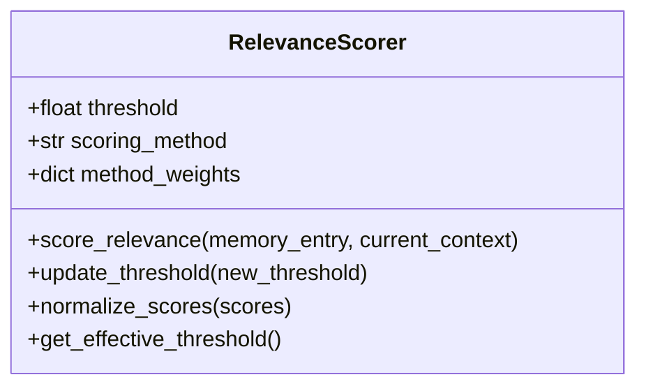

# RelevanceScorer

## Overview

`RelevanceScorer` is a class that calculates and manages relevance scores for memory entries in the CMR system. It determines how pertinent a memory is to the current context, influencing both memory retention and retrieval.

## Key Features

- Dynamic relevance scoring
- Configurable thresholding
- Score normalization
- Integration with memory buffers
- Support for different scoring strategies

## Architecture



## Usage Example

```python
from models.scoring import RelevanceScorer
import torch

# Initialize with configuration
scorer = RelevanceScorer(
    threshold=0.5,
    scoring_method='hybrid',
    method_weights={
        'semantic': 0.6,
        'temporal': 0.3,
        'frequency': 0.1
    }
)

# Score a memory entry
memory_entry = get_memory_entry()  # Get a memory entry
current_context = get_current_context()  # Get current context

score = scorer.score_relevance(memory_entry, current_context)
print(f"Relevance score: {score:.2f}")

# Update threshold dynamically
scorer.update_threshold(0.6)
```

## Core Methods

- `score_relevance(memory_entry, current_context)`: Calculates relevance score
- `update_threshold(new_threshold)`: Updates the relevance threshold
- `normalize_scores(scores)`: Normalizes scores to a 0-1 range
- `get_effective_threshold()`: Returns the current threshold value

## Configuration

Configure using the following parameters:

- `threshold`: Minimum score for memory retention (default: 0.5)
- `scoring_method`: Strategy for calculating relevance ('hybrid', 'semantic', 'temporal', etc.)
- `method_weights`: Weights for different scoring components
- `decay_factor`: Rate at which relevance decays over time (if applicable)

## Scoring Strategies

1. **Semantic Similarity**: Based on content similarity
2. **Temporal Proximity**: More recent memories score higher
3. **Frequency**: Frequently accessed memories score higher
4. **Hybrid**: Weighted combination of multiple strategies

## Best Practices

- Adjust weights based on application needs
- Monitor score distributions for calibration
- Consider implementing adaptive thresholds
- Cache frequently used calculations for performance
