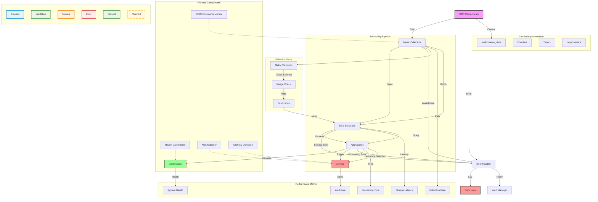

# Monitoring Module

The monitoring module provides comprehensive performance monitoring and metrics collection for the Contextual Memory Reweaving (CMR) system. This module enables real-time tracking, health monitoring, and diagnostic capabilities for CMR components.

## Overview

## Table of Contents

- [Overview](#overview)
- [Key Components](#key-components)
- [Metrics Collection](#metrics-collection)
- [Real-time Monitoring (Planned)](#real-time-monitoring-planned)
- [Diagnostic Tools](#diagnostic-tools)
- [Configuration](#configuration)
- [Integration with CMR System](#integration-with-cmr-system)
- [Best Practices](#best-practices)
- [Troubleshooting](#troubleshooting)
- [Output Formats](#output-formats)



The monitoring module is designed to provide visibility into the CMR system's performance, health, and behavior. It includes performance tracking, metrics collection, health monitoring, and diagnostic tools to ensure optimal system operation.

### Current Implementation

- **Basic Metrics**: Tracked via `performance_stats` dictionary
- **Counters**: Operation counts and totals
- **Averages**: Basic timing statistics
- **Per-layer Stats**: Layer-specific performance metrics

### Planned Enhancements

- **Dedicated Monitor**: `CMRPerformanceMonitor` class
- **Real-time Dashboards**: Visual monitoring interface
- **Advanced Alerting**: Threshold-based notifications
- **Historical Analysis**: Long-term trend tracking

Note: Monitoring is currently provided via `FullCMRModel.performance_stats` (a dict) and related helper methods. A dedicated `CMRPerformanceMonitor` class is planned but not yet implemented. Other features described below (real-time monitoring, health dashboards, alerting) are also planned.

## Key Components

### CMR Performance Monitoring (Current and Planned)

[View Class Documentation](./cmr_performance_monitor.md)

Current: `FullCMRModel.performance_stats` provides basic counters and averages (e.g., total_captures, total_reconstructions, avg_* times). Planned: a `CMRPerformanceMonitor` class.

**Tracked Metrics:**

- **Capture Metrics**: Memory capture timing and counts
- **Reconstruction Metrics**: State reconstruction performance
- **Layer-wise Statistics**: Per-layer performance breakdown
- **Memory Usage**: Buffer utilization and efficiency
- **Timing Analysis**: Detailed timing breakdowns

**Key Features:**

- Real-time metric collection
- Historical performance tracking
- Statistical analysis and aggregation
- Performance trend identification
- Bottleneck detection

**Usage Example (current):**

```python
from models.cmr_full_integrated import FullCMRModel

# After running a forward pass with return_memory_info=True
outputs = model.forward(input_ids, return_memory_info=True)
perf_stats = outputs.get('performance_stats', {})
```

### Health Monitoring (Planned)

[View Planned Implementation Details](./health_monitor.md)

The monitoring system provides comprehensive health monitoring capabilities:

**Health Metrics:**

- **System Health Score**: Overall system health assessment
- **Component Status**: Individual component health status
- **Resource Utilization**: CPU, GPU, and memory usage
- **Error Rates**: Error frequency and patterns
- **Performance Degradation**: Performance trend analysis

**Health Indicators:**

- **Green**: System operating optimally
- **Yellow**: Minor performance issues detected
- **Red**: Critical issues requiring attention

### Diagnostic Capabilities (Planned)

[View Planned Implementation Details](./diagnostics.md)

**Diagnostic Features:**

- **Component Health Analysis**: Individual component diagnostics
- **Hook System Analysis**: Hook performance and conflicts
- **Memory Buffer Analysis**: Buffer efficiency and patterns
- **Error Logging**: Comprehensive error tracking
- **Performance Profiling**: Detailed performance breakdowns

## Metrics Collection

[View Metrics Documentation](./metrics.md)

### Performance Metrics

**Timing Metrics:**

```python
metrics = {
    'capture_times': [0.001, 0.002, 0.001],      # Memory capture times
    'reconstruction_times': [0.003, 0.002],       # Reconstruction times
    'total_forward_time': 0.050,                  # Total forward pass time
    'avg_capture_time': 0.0013,                   # Average capture time
    'avg_reconstruction_time': 0.0025             # Average reconstruction time
}
```

**Count Metrics:**

```python
metrics = {
    'total_captures': 150,                        # Total memory captures
    'total_reconstructions': 75,                  # Total reconstructions
    'states_captured_per_layer': {4: 50, 6: 100}, # Per-layer captures
    'states_stored_per_layer': {4: 45, 6: 90},   # Per-layer storage
    'reconstructions_per_layer': {4: 25, 6: 50}  # Per-layer reconstructions
}
```

**Efficiency Metrics:**

```python
metrics = {
    'capture_efficiency': 0.95,                   # Capture success rate
    'storage_efficiency': 0.90,                   # Storage success rate
    'reconstruction_quality': 0.85,               # Reconstruction quality
    'memory_utilization': 0.75,                   # Buffer utilization
    'cache_hit_rate': 0.80                        # Cache efficiency
}
```

### Memory Metrics

**Buffer Statistics:**

```python
buffer_stats = {
    'total_entries': 1500,                        # Total stored entries
    'entries_per_layer': {4: 500, 6: 1000},      # Per-layer entries
    'memory_size_mb': 45.2,                       # Memory usage in MB
    'utilization_rate': 0.75,                     # Buffer utilization
    'eviction_count': 50,                         # Total evictions
    'eviction_rate': 0.03                         # Eviction frequency
}
```

**Retrieval Statistics:**

```python
retrieval_stats = {
    'total_retrievals': 200,                      # Total retrieval operations
    'avg_retrieval_time': 0.002,                  # Average retrieval time
    'cache_hits': 160,                            # Cache hit count
    'cache_hit_rate': 0.80,                       # Cache hit rate
    'retrieval_quality': 0.88                     # Retrieval quality score
}
```

## Real-time Monitoring (Planned)

### Live Performance Tracking

The monitoring system provides real-time performance tracking:

**Real-time Features:**

- Live metric updates during model execution
- Performance trend visualization
- Anomaly detection and alerting
- Resource usage monitoring
- Bottleneck identification

**Usage Example:**

```python
# Enable real-time monitoring
monitor.enable_real_time_monitoring()

# Process input with monitoring
with monitor.track_performance():
    outputs = model(input_ids)

# Get real-time stats
live_stats = monitor.get_live_stats()
```

### Health Monitoring Dashboard (Planned)

**Dashboard Features:**

- System health overview
- Component status indicators
- Performance trend charts
- Resource utilization graphs
- Error rate tracking

## Diagnostic Tools

### Component Diagnostics

**Diagnostic Capabilities:**

- Memory buffer health assessment
- Hook system performance analysis
- Retrieval system efficiency evaluation
- Reconstruction quality analysis
- Optimization impact assessment

**Usage Example:**

```python
# Run comprehensive diagnostics
diagnostics = monitor.run_diagnostics()

# Check component health
component_health = diagnostics['component_health']
hook_analysis = diagnostics['hook_analysis']
memory_analysis = diagnostics['memory_analysis']
```

### Performance Profiling

**Profiling Features:**

- Detailed timing breakdowns
- Memory allocation tracking
- GPU utilization analysis
- Bottleneck identification
- Performance regression detection

**Usage Example:**

```python
# Enable profiling
monitor.enable_profiling()

# Run profiled execution
with monitor.profile_execution():
    outputs = model(input_ids)

# Get profiling results
profile_results = monitor.get_profile_results()
```

## Configuration

### Monitoring Configuration

```python
monitoring_config = {
    'enable_real_time': True,                     # Enable real-time monitoring
    'enable_profiling': False,                    # Enable detailed profiling
    'metric_collection_interval': 1.0,           # Metric collection interval
    'health_check_interval': 5.0,                # Health check interval
    'max_history_size': 1000,                    # Maximum history entries
    'alert_thresholds': {
        'high_latency': 0.1,                      # High latency threshold
        'low_efficiency': 0.7,                    # Low efficiency threshold
        'high_error_rate': 0.05                   # High error rate threshold
    }
}
```

### Alert Configuration (Planned)

```python
alert_config = {
    'enable_alerts': True,                        # Enable alerting
    'alert_channels': ['console', 'log'],        # Alert channels
    'severity_levels': ['warning', 'error', 'critical'], # Severity levels
    'alert_cooldown': 60.0,                       # Alert cooldown period
    'escalation_rules': {
        'critical': {'immediate': True},          # Critical alert rules
        'error': {'delay': 30.0},                 # Error alert rules
        'warning': {'delay': 300.0}               # Warning alert rules
    }
}
```

## Integration with CMR System

### Automatic Integration

The monitoring system automatically integrates with:

**CMR Components:**

- **FullCMRModel**: Comprehensive model monitoring
- **Memory Buffer**: Buffer performance tracking
- **Retrieval System**: Retrieval efficiency monitoring
- **Reconstruction System**: Reconstruction quality tracking
- **Optimization System**: Optimization impact analysis

### Hook-based Monitoring

**Monitoring Hooks:**

- Pre-processing hooks for input analysis
- Layer-wise hooks for intermediate monitoring
- Post-processing hooks for output analysis
- Error handling hooks for failure tracking

## Best Practices

### Monitoring Setup

1. **Selective Monitoring**: Enable monitoring for critical components
2. **Performance Impact**: Consider monitoring overhead
3. **Storage Management**: Manage metric storage efficiently
4. **Alert Configuration**: Configure appropriate alert thresholds

### Performance Optimization

1. **Minimal Overhead**: Keep monitoring overhead low
2. **Efficient Collection**: Use efficient metric collection methods
3. **Smart Sampling**: Sample metrics intelligently
4. **Batch Processing**: Process metrics in batches

### Data Management

1. **Retention Policies**: Implement appropriate data retention
2. **Aggregation**: Aggregate metrics for long-term storage
3. **Compression**: Compress historical data
4. **Cleanup**: Regular cleanup of old metrics

## Troubleshooting

### Common Issues

- **High Monitoring Overhead**: Reduce monitoring frequency or scope
- **Memory Usage**: Limit metric history size
- **Alert Fatigue**: Tune alert thresholds appropriately
- **Missing Metrics**: Verify monitoring is properly enabled

### Performance Tips

- Use sampling for high-frequency metrics
- Aggregate metrics for better performance
- Configure appropriate retention policies
- Monitor the monitoring system itself

## Output Formats

### Metric Reports

The monitoring system generates various report formats:

**JSON Reports:**

```json
{
  "timestamp": "2024-01-15T10:30:00Z",
  "system_health": "healthy",
  "performance_metrics": {
    "avg_latency": 0.025,
    "throughput": 150.5,
    "error_rate": 0.001
  },
  "component_status": {
    "memory_buffer": "healthy",
    "retrieval_system": "healthy",
    "reconstruction": "warning"
  }
}
```

**CSV Exports:**

- Time-series performance data
- Component health history
- Error logs and patterns
- Resource utilization trends

### Visualization Support

The monitoring system supports various visualization formats:

- Performance trend charts
- Health status dashboards
- Resource utilization graphs
- Error rate tracking
- Component status indicators
