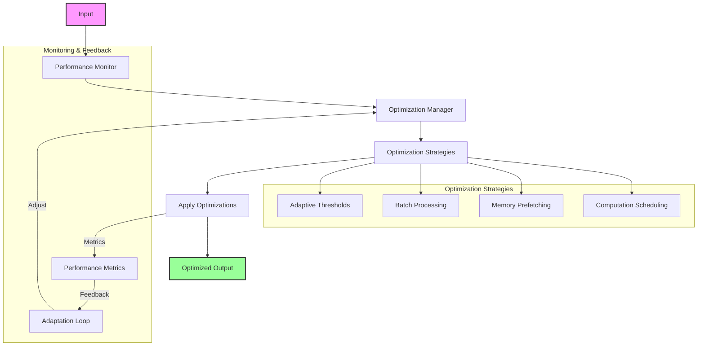

# Optimization Module

The optimization module provides comprehensive performance optimization capabilities for the Contextual Memory Reweaving (CMR) system. This module implements adaptive optimization strategies, caching mechanisms, and background processing to maximize system efficiency.

## Overview



The optimization module is designed to enhance CMR system performance through intelligent optimization strategies. It includes adaptive threshold management, batch processing optimization, memory prefetching, computation scheduling, and background optimization tasks.

## Table of Contents

- [Overview](#overview)
- [Optimization Workflow](#optimization-workflow)
- [Key Optimization Areas](#key-optimization-areas)
- [Key Components](#key-components)
- [Optimization Strategies](#optimization-strategies)
- [Configuration](#configuration)
- [Performance Metrics](#performance-metrics)
- [Integration with CMR System](#integration-with-cmr-system)
- [Best Practices](#best-practices)
- [Troubleshooting](#troubleshooting)
- [Advanced Features](#advanced-features)

## Optimization Workflow

1. **Performance Monitoring**: Continuously collects performance metrics
2. **Strategy Selection**: Chooses appropriate optimization strategies
3. **Optimization Application**: Applies selected optimizations
4. **Feedback Loop**: Measures impact and adjusts strategies

## Key Optimization Areas

- **Adaptive Thresholds**: Dynamic adjustment of system parameters
- **Batch Processing**: Efficient handling of multiple inputs
- **Memory Management**: Optimized memory access and prefetching
- **Computation Scheduling**: Intelligent task prioritization

## Key Components

### CMR Performance Optimizer (`performance_optimization.py`)

[View Class Documentation](./performance_optimization.md)

The `CMRPerformanceOptimizer` class provides the main optimization coordination:

**Core Optimization Components:**

- **AdaptiveThresholdManager**: Dynamic threshold adjustment
- **BatchProcessingOptimizer**: Batch size and padding optimization
- **MemoryPrefetcher**: Predictive memory loading
- **ComputationScheduler**: Task scheduling optimization
- **BackgroundOptimizer**: Asynchronous optimization tasks

**Key Features:**

- Real-time performance optimization
- Adaptive parameter tuning
- Resource utilization optimization
- Background processing coordination
- Performance impact tracking

**Usage Example:**

```python
from models.performance_optimization import CMRPerformanceOptimizer

# Initialize optimizer
optimizer = CMRPerformanceOptimizer(cmr_model, optimization_config)

# Optimize forward pass
opt_inputs, opt_mask, opt_info = optimizer.optimize_forward_pass(input_ids, attention_mask)

# Get optimization statistics
stats = optimizer.get_optimization_stats()
```

### Adaptive Threshold Manager

[View Class Documentation](./adaptive_threshold_manager.md)

The `AdaptiveThresholdManager` dynamically adjusts system thresholds based on performance:

**Adaptive Features:**

- **Relevance Threshold Adjustment**: Dynamic relevance score thresholds
- **Memory Pressure Response**: Threshold adjustment based on memory usage
- **Performance-based Tuning**: Threshold optimization for performance
- **Quality Maintenance**: Balance between performance and quality

**Threshold Types:**

- Relevance score thresholds for memory storage
- Retrieval similarity thresholds
- Eviction priority thresholds
- Reconstruction quality thresholds

**Usage Example:**

```python
from models.performance_optimization import AdaptiveThresholdManager

threshold_manager = AdaptiveThresholdManager(base_threshold=0.5)

# Suggest an optimal threshold given input shape and memory usage
suggested = threshold_manager.get_optimal_threshold(
    input_shape=(batch_size, seq_len),
    memory_usage={'total_entries': current_total_entries}
)

if suggested is not None:
    # Apply to your model's relevance scorer if present
    cmr_model.relevance_scorer.relevance_threshold = suggested
    threshold_manager.update_threshold(layer_idx=0, threshold=suggested, performance=1.0)
```

### Batch Processing Optimizer

[View Class Documentation](./batch_processing_optimizer.md)

The `BatchProcessingOptimizer` optimizes batch processing for better efficiency:

**Optimization Strategies:**

- **Dynamic Batch Sizing**: Optimal batch size selection
- **Padding Reduction**: Minimize unnecessary padding
- **Sequence Length Optimization**: Efficient sequence handling
- **Memory-aware Batching**: Batch size based on available memory

**Key Features:**

- Automatic batch size adjustment
- Padding waste reduction
- Memory usage optimization
- Throughput maximization

**Usage Example:**

```python
from models.performance_optimization import BatchProcessingOptimizer

batch_optimizer = BatchProcessingOptimizer()

# Optimize batch
optimized_batch, optimized_mask = batch_optimizer.optimize_batch(
    input_batch, attention_mask
)
```

### Memory Prefetcher

[View Class Documentation](./memory_prefetcher.md)

The `MemoryPrefetcher` implements predictive memory loading:

**Prefetching Strategies:**

- **Pattern-based Prefetching**: Based on access patterns
- **Similarity-based Prefetching**: Prefetch similar memories
- **Temporal Prefetching**: Based on temporal patterns
- **Context-aware Prefetching**: Context-driven prefetching

**Key Features:**

- Predictive memory loading
- Cache hit rate optimization
- Access pattern learning
- Adaptive prefetching strategies

**Usage Example:**

```python
from models.performance_optimization import MemoryPrefetcher

prefetcher = MemoryPrefetcher(memory_buffer)
prefetch_info = prefetcher.prefetch_for_input(input_ids)
```

### Computation Scheduler

[View Class Documentation](./computation_scheduler.md)

The `ComputationScheduler` optimizes computation task scheduling:

**Scheduling Features:**

- **Priority-based Scheduling**: Task prioritization
- **Resource-aware Scheduling**: Consider available resources
- **Dependency Management**: Handle task dependencies
- **Load Balancing**: Distribute computational load

**Task Types:**

- Memory capture tasks
- Reconstruction tasks
- Retrieval operations
- Background optimization tasks

**Usage Example:**

```python
from models.performance_optimization import ComputationScheduler

scheduler = ComputationScheduler()
task_id = scheduler.schedule_task(task_type='reconstruction', priority='high')
```

### Background Optimizer

[View Class Documentation](./background_optimizer.md)

The `BackgroundOptimizer` performs asynchronous optimization tasks:

**Background Tasks:**

- **Memory Buffer Cleanup**: Periodic buffer maintenance
- **Cache Optimization**: Cache efficiency improvements
- **Threshold Tuning**: Continuous threshold optimization
- **Performance Analysis**: Background performance analysis

**Key Features:**

- Asynchronous task execution
- Non-blocking optimization
- Continuous improvement
- Resource-aware processing

**Usage Example:**

```python
from models.performance_optimization import BackgroundOptimizer

background_optimizer = BackgroundOptimizer(cmr_model, interval_seconds=30.0)
background_optimizer.start()

# ... later
background_optimizer.stop()
```

## Optimization Strategies

### Adaptive Optimization

**Dynamic Parameter Adjustment:**

- Real-time threshold adjustment based on performance
- Adaptive batch sizing based on system load
- Dynamic memory allocation based on usage patterns
- Automatic quality-performance trade-off optimization

**Performance-driven Optimization:**

- Latency-focused optimization for real-time applications
- Throughput-focused optimization for batch processing
- Memory-focused optimization for resource-constrained environments
- Quality-focused optimization for accuracy-critical applications

### Resource Optimization

**Memory Optimization:**

- Efficient memory allocation and deallocation
- Memory pool management
- Garbage collection optimization
- Memory fragmentation reduction

**Compute Optimization:**

- CPU/GPU utilization optimization
- Parallel processing coordination
- Task scheduling optimization
- Resource contention minimization

## Configuration

### Optimization Configuration

```python
optimization_config = {
    'enable_adaptive_thresholds': True,           # Enable adaptive thresholds
    'enable_batch_optimization': True,            # Enable batch optimization
    'enable_prefetching': True,                   # Enable memory prefetching
    'enable_background_optimization': True,       # Enable background tasks
    'optimization_interval': 10.0,               # Optimization interval
    'performance_target': {
        'max_latency': 0.1,                       # Maximum acceptable latency
        'min_throughput': 100.0,                  # Minimum throughput
        'max_memory_usage': 0.8                   # Maximum memory usage
    }
}
```

### Threshold Configuration

```python
threshold_config = {
    'initial_relevance_threshold': 0.5,           # Initial relevance threshold
    'threshold_adjustment_rate': 0.1,             # Adjustment rate
    'min_threshold': 0.1,                         # Minimum threshold
    'max_threshold': 0.9,                         # Maximum threshold
    'adaptation_window': 100,                     # Adaptation window size
    'quality_weight': 0.7,                        # Quality importance weight
    'performance_weight': 0.3                     # Performance importance weight
}
```

### Prefetching Configuration

```python
prefetching_config = {
    'prefetch_strategies': ['pattern', 'similarity'], # Prefetching strategies
    'prefetch_window': 10,                        # Prefetch window size
    'max_prefetch_entries': 50,                   # Maximum prefetch entries
    'prefetch_threshold': 0.7,                    # Prefetch confidence threshold
    'cache_size': 1000,                           # Prefetch cache size
    'hit_rate_target': 0.8                        # Target cache hit rate
}
```

## Performance Metrics

### Optimization Metrics

**Efficiency Metrics:**

```python
optimization_metrics = {
    'threshold_adjustments': 25,                  # Number of threshold adjustments
    'batch_optimizations': 150,                   # Number of batch optimizations
    'prefetch_hits': 800,                         # Prefetch cache hits
    'computation_savings': 0.15,                  # Computation time savings
    'memory_savings': 0.20,                       # Memory usage savings
    'overall_speedup': 1.35                       # Overall performance speedup
}
```

**Resource Utilization:**

```python
resource_metrics = {
    'cpu_utilization': 0.75,                      # CPU utilization rate
    'gpu_utilization': 0.85,                      # GPU utilization rate
    'memory_utilization': 0.70,                   # Memory utilization rate
    'cache_hit_rate': 0.82,                       # Cache hit rate
    'task_completion_rate': 0.95                  # Task completion rate
}
```

## Integration with CMR System

### Automatic Integration

The optimization module automatically integrates with:

**CMR Components:**

- **Memory Buffer**: Buffer optimization and cleanup
- **Retrieval System**: Retrieval strategy optimization
- **Reconstruction System**: Reconstruction efficiency optimization
- **Monitoring System**: Performance-driven optimization

### Optimization Hooks

**Hook Types:**

- Pre-processing optimization hooks
- Runtime optimization hooks
- Post-processing optimization hooks
- Background optimization hooks

## Best Practices

### Optimization Setup

1. **Gradual Enablement**: Enable optimizations gradually
2. **Performance Monitoring**: Monitor optimization impact
3. **Configuration Tuning**: Tune optimization parameters
4. **Resource Awareness**: Consider available resources

### Performance Tuning

1. **Baseline Measurement**: Establish performance baselines
2. **Incremental Optimization**: Apply optimizations incrementally
3. **A/B Testing**: Test optimization effectiveness
4. **Continuous Monitoring**: Monitor long-term performance

### Resource Management

1. **Memory Management**: Optimize memory usage patterns
2. **CPU/GPU Balance**: Balance CPU and GPU utilization
3. **I/O Optimization**: Optimize data transfer operations
4. **Cache Management**: Implement effective caching strategies

## Troubleshooting

### Common Issues

- **Over-optimization**: Avoid excessive optimization overhead
- **Resource Contention**: Monitor resource conflicts
- **Quality Degradation**: Balance performance and quality
- **Configuration Conflicts**: Ensure configuration consistency

### Performance Tips

- Start with conservative optimization settings
- Monitor optimization impact continuously
- Adjust parameters based on workload characteristics
- Use profiling to identify optimization opportunities

## Advanced Features

### Machine Learning-based Optimization

**ML-driven Features:**

- Predictive threshold adjustment
- Learned prefetching patterns
- Adaptive batch sizing
- Intelligent task scheduling

### Multi-objective Optimization

**Optimization Objectives:**

- Minimize latency while maintaining quality
- Maximize throughput within memory constraints
- Balance accuracy and efficiency
- Optimize for specific hardware configurations

### Custom Optimization Strategies

**Extensibility Features:**

- Custom optimization strategy plugins
- User-defined optimization objectives
- Configurable optimization pipelines
- Integration with external optimization tools
