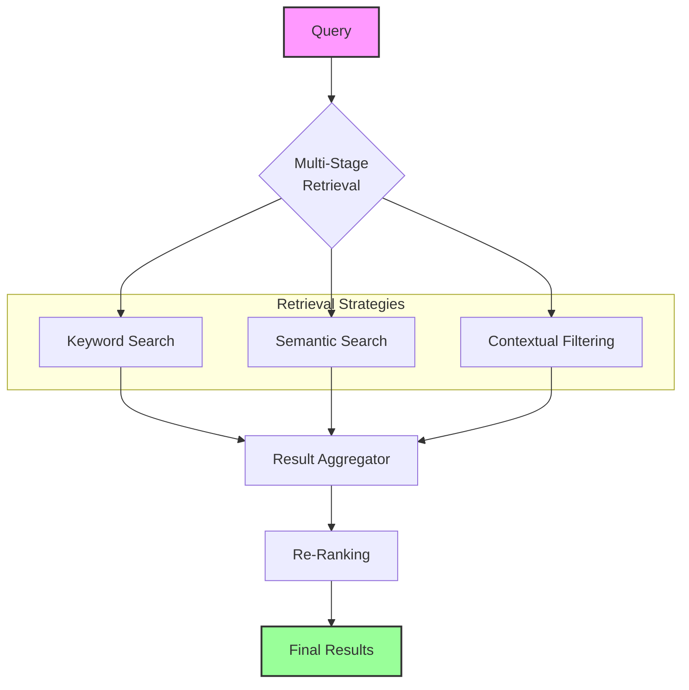
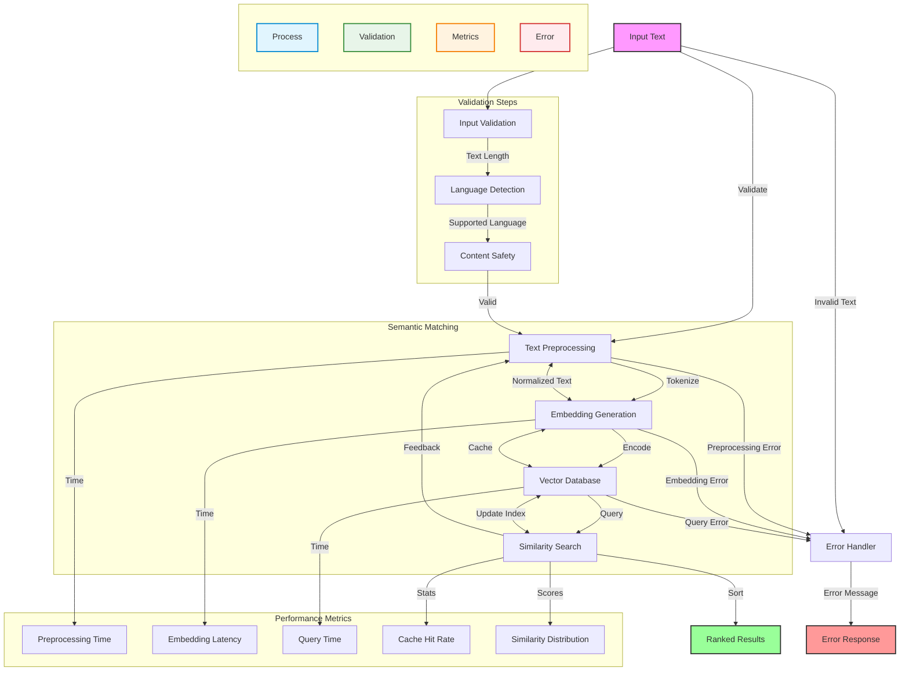
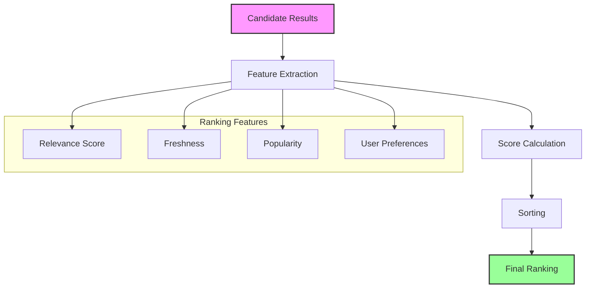
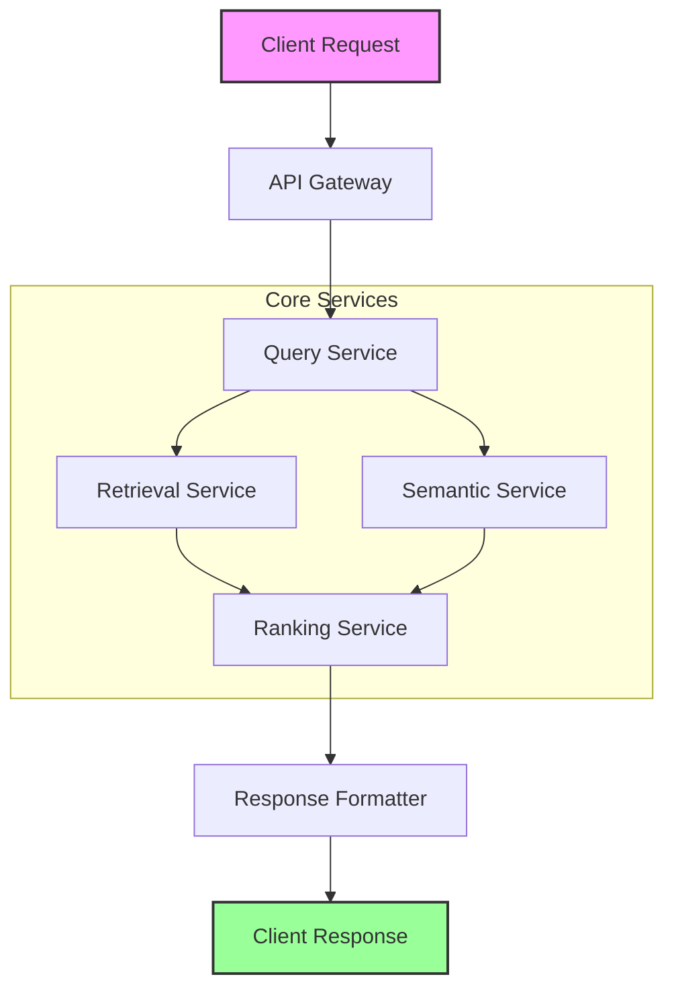
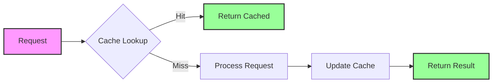

# Services Module

The services module provides retrieval and processing services for the Contextual Memory Reweaving (CMR) system. This module contains advanced memory retrieval strategies, semantic matching services, and multi-criteria ranking systems that enable sophisticated memory operations.

## Overview

```mermaid
graph TD
    %% Main Flow
    A[Input Query] -->|Validate Input|### 5. Query Processor

[View Class Documentation](./query_processor.md)]
    B -->|Extract Features| C[Semantic Matcher]
    B -->|Score Relevance| D[Relevance Scorer]
    C -->|Find Similar| E[Memory Retriever]
    D -->|Filter by Score| E
    E -->|Rank Results| F[Result Ranker]
    F -->|Generate Response|### 4. Response Generator

[View Class Documentation](./response_generator.md)]
    G --> H[Output Response]
    
    %% Error Handling
    A -->|Invalid Input| I[Error Handler]
    C -->|No Matches| I
    E -->|Retrieval Failed| I
    I --> H
    
    %% Data Validation
    subgraph "Data Validation"
        VA[Input Validation] -->|Valid| B
        VB[Semantic Validation] -->|Valid| C
        VC[Result Validation] -->|Valid| F
    end
    
    A --> VA
    VC -->|Valid| F
    
    %% Performance Metrics
    subgraph "Performance Monitoring"
        M1[Query Processing Time]
        M2[Cache Hit Rate]
        M3[Retrieval Latency]
        M4[Ranking Accuracy]
    end
    
    B -->|Log| M1
    C -->|Log| M2
    E -->|Log| M3
    F -->|Log| M4
    
    %% Component Interactions
    subgraph "Memory Services"
        C <-->|Context| D
        C <-->|Cache| E
        D <-->|Feedback| E
        E <-->|Optimize| F
    end
    
    style A fill:#f9f,stroke:#333,stroke-width:2px
    style H fill:#9f9,stroke:#333,stroke-width:2px
    style I fill:#f99,stroke:#333,stroke-width:2px
    
    %% Legend
    subgraph " "
        direction TB
        L1[Process]:::process
        L2[Validation]:::validation
        L3[Metrics]:::metrics
    end
    
    classDef process fill:#e1f5fe,stroke:#0288d1,stroke-width:2px
    classDef validation fill:#e8f5e9,stroke:#388e3c,stroke-width:2px
    classDef metrics fill:#fff3e0,stroke:#f57c00,stroke-width:2px
```

The services module implements high-level services that coordinate memory operations across the CMR system. It provides advanced retrieval strategies, semantic analysis capabilities, and intelligent ranking systems that enhance the quality and efficiency of memory operations.

## Table of Contents

- [Overview](#overview)
- [System Architecture](#system-architecture)
- [Key Components](#key-components)
- [Integration Guide](#integration-guide)
- [Performance Considerations](#performance-considerations)
- [Service Architecture](#service-architecture)
- [Configuration](#configuration)
- [Performance Optimization](#performance-optimization)
- [Quality Assurance](#quality-assurance)
- [Integration with CMR System](#integration-with-cmr-system)
- [Best Practices](#best-practices)
- [Troubleshooting](#troubleshooting)
- [Future Enhancements](#future-enhancements)

## System Architecture

### Data Flow

1. **Query Processing**: Input queries are processed and normalized
2. **Semantic Matching**: Finds semantically related memories
3. **Relevance Scoring**: Assigns relevance scores to potential matches
4. **Memory Retrieval**: Fetches the most relevant memories
5. **Result Ranking**: Ranks results based on multiple criteria
6. **Response Generation**: Generates final response with memory context

## Key Components

### 1. Advanced Memory Retrieval Services

[View Class Documentation](./advanced_retrieval_service.md)



The services module provides sophisticated memory retrieval capabilities through the `AdvancedMemoryRetriever` system, which implements a multi-stage retrieval pipeline:

1. **Multi-Stage Retrieval**: Combines multiple retrieval strategies
2. **Hybrid Search**: Merges keyword and semantic search results
3. **Context-Aware Filtering**: Applies contextual constraints
4. **Result Re-ranking**: Reranks results based on multiple criteria

#### Key Features

- **Adaptive Retrieval**: Dynamically adjusts retrieval strategy based on query type
- **Performance Optimization**: Efficient indexing and caching mechanisms
- **Extensible Architecture**: Easy to add new retrieval methods
- **Context Integration**: Considers conversation history and user context

#### Usage Example

```python
from services.retrieval import AdvancedMemoryRetriever
from models import MemoryEntry

# Initialize with configuration
retriever = AdvancedMemoryRetriever(
    strategies=['semantic', 'keyword', 'temporal'],
    weights={'semantic': 0.6, 'keyword': 0.3, 'temporal': 0.1},
    cache_size=1000
)

# Add memories
memories = [MemoryEntry(...) for _ in range(1000)]
retriever.index(memories)

# Retrieve relevant memories
results = retriever.retrieve(
    query="example query",
    context={"conversation_id": "123"},
    top_k=5
)
```

### 2. Semantic Matching Service

[View Class Documentation](./semantic_matching_service.md)



The Semantic Matching Service enables understanding and matching of text based on meaning rather than just keywords.

#### Semantic Matching Key Components

1. **Text Preprocessing**
   - Tokenization and normalization
   - Stopword removal
   - Lemmatization/Stemming

2. **Embedding Generation**
   - Transformer-based embeddings
   - Contextual representations
   - Dimensionality reduction

3. **Vector Similarity**
   - Cosine similarity
   - Approximate Nearest Neighbor (ANN) search
   - Hybrid scoring

#### Semantic Matching Usage Example

```python
from services.semantic import SemanticMatcher

# Initialize with pre-trained model
matcher = SemanticMatcher(
    model_name='all-mpnet-base-v2',
    max_seq_length=512
)

# Add documents to index
documents = ["First document", "Second document"]
matcher.index(documents)

# Find similar documents
results = matcher.find_similar(
    query="example query",
    top_k=3,
    threshold=0.7
)
```

### 3. Result Ranking Service



The Result Ranking Service provides sophisticated ranking of search results using multiple signals.

#### Ranking Factors

1. **Relevance**
   - Semantic similarity
   - Keyword matching
   - Contextual relevance

2. **Freshness**
   - Document age
   - Update frequency
   - Temporal decay

3. **Popularity**
   - Click-through rates
   - User engagement
   - Social signals

#### Result Ranking Usage Example

```python
from services.ranking import ResultRanker

# Initialize ranker with custom weights
ranker = ResultRanker(
    weights={
        'relevance': 0.5,
        'freshness': 0.3,
        'popularity': 0.2
    },
    decay_rate=0.1
)

# Rank results
ranked_results = ranker.rank(
    results=search_results,
    query=user_query,
    context={
        'user_id': '123',
        'session_id': 'abc'
    }
)
```

## Integration Guide

### Service Composition



### Configuration Options

```yaml
services:
  retrieval:
    strategies:
      - name: semantic
        weight: 0.6
      - name: keyword
        weight: 0.3
      - name: temporal
        weight: 0.1
    cache:
      enabled: true
      ttl: 3600
      max_size: 10000
  
  semantic:
    model: all-mpnet-base-v2
    max_sequence_length: 512
    batch_size: 32
  
  ranking:
    weights:
      relevance: 0.5
      freshness: 0.3
      popularity: 0.2
    decay_rate: 0.1
```

## Performance Considerations

### Caching Strategy



### Scaling Recommendations

1. **Horizontal Scaling**
   - Stateless service design
   - Load balancing
   - Auto-scaling groups

2. **Database Optimization**
   - Read replicas
   - Sharding
   - Connection pooling

3. **Caching Layers**
   - Distributed caching
   - Multi-level caching
   - Smart invalidation

- **Semantic Memory Matching**: Content-based similarity computation
- **Contextual Relevance Scoring**: Context-aware relevance assessment
- **Multi-criteria Ranking**: Multi-dimensional memory ranking
- **Hierarchical Memory Organization**: Structured memory hierarchy
- **Retrieval Caching**: Efficient caching for repeated queries

**Retrieval Strategies:**

- **Semantic Similarity**: Content-based matching using embeddings
- **Contextual Relevance**: Context-aware scoring mechanisms
- **Multi-criteria**: Combined ranking using multiple factors
- **Hierarchical**: Tree-based memory organization traversal
- **Task-specific**: Specialized retrieval for specific tasks
- **Hybrid Ensemble**: Combination of multiple strategies

### Semantic Memory Matcher

The `SemanticMemoryMatcher` provides content-based similarity computation:

**Key Features:**

- High-dimensional similarity computation
- Efficient similarity search algorithms
- Configurable similarity thresholds
- Batch similarity processing
- Similarity caching for performance

**Similarity Metrics:**

- Cosine similarity for semantic matching
- Euclidean distance for geometric relationships
- Dot product for attention-based similarity
- Custom similarity functions

**Usage Example:**

```python
from models.advanced_retrieval import SemanticMemoryMatcher

# Initialize semantic matcher
matcher = SemanticMemoryMatcher(
    hidden_size=768,
    similarity_threshold=0.7
)

# Compute similarities
similarities = matcher.compute_similarities(
    query_states=current_hidden_states,
    memory_states=candidate_memories
)
```

### Contextual Relevance Scorer

The `ContextualRelevanceScorer` provides context-aware relevance assessment:

**Contextual Features:**

- Multi-head attention for context analysis
- Position-aware relevance scoring
- Temporal context consideration
- Task-specific context adaptation

**Scoring Mechanisms:**

- Attention-based relevance computation
- Context vector generation
- Relevance score normalization
- Confidence estimation

**Usage Example:**

```python
from models.advanced_retrieval import ContextualRelevanceScorer

# Initialize contextual scorer
scorer = ContextualRelevanceScorer(
    hidden_size=768,
    num_heads=8
)

# Score contextual relevance
relevance_scores = scorer.score_relevance(
    query_context=current_context,
    memory_contexts=memory_candidates
)
```

### Multi-criteria Ranking System

The `MultiCriteriaRanker` provides sophisticated ranking using multiple criteria:

**Ranking Criteria:**

- **Relevance**: Content relevance to current context
- **Similarity**: Semantic similarity to query
- **Recency**: Temporal freshness of memories
- **Diversity**: Diversity in retrieved memory set
- **Quality**: Memory quality and reliability scores
- **Frequency**: Access frequency and popularity

**Ranking Features:**

- Weighted combination of multiple criteria
- Configurable criterion weights
- Adaptive weight adjustment
- Pareto-optimal ranking
- Diversity-aware selection

**Usage Example:**

```python
from models.advanced_retrieval import MultiCriteriaRanker

# Initialize ranker
ranker = MultiCriteriaRanker(
    hidden_size=768,
    criteria_weights={
        'relevance': 0.4,
        'similarity': 0.3,
        'recency': 0.2,
        'diversity': 0.1
    }
)

# Rank memories
ranked_memories = ranker.rank_memories(
    memories=candidate_memories,
    query_context=current_context
)
```

### Memory Hierarchy Service

The `MemoryHierarchy` service provides structured memory organization:

**Hierarchical Features:**

- Tree-based memory organization
- Cluster-based memory grouping
- Hierarchical similarity search
- Dynamic hierarchy adaptation
- Efficient traversal algorithms

**Organization Strategies:**

- Content-based clustering
- Temporal hierarchy organization
- Task-specific hierarchies
- Adaptive hierarchy restructuring

**Usage Example:**

```python
from models.advanced_retrieval import MemoryHierarchy

# Initialize memory hierarchy
hierarchy = MemoryHierarchy(
    hidden_size=768,
    max_clusters=32
)

# Organize memories hierarchically
hierarchy.organize_memories(memory_collection)

# Retrieve from hierarchy
retrieved = hierarchy.retrieve_hierarchical(
    query=current_context,
    max_results=10
)
```

### Retrieval Cache Service

The `RetrievalCache` service provides efficient caching for memory operations:

**Caching Features:**

- LRU-based cache management
- Query-result caching
- Similarity computation caching
- Hierarchical cache structure
- Cache hit rate optimization

**Cache Types:**

- Query result caching
- Similarity matrix caching
- Ranking result caching
- Intermediate computation caching

**Usage Example:**

```python
from models.advanced_retrieval import RetrievalCache

# Initialize retrieval cache
cache = RetrievalCache(cache_size=1000)

# Check cache for query
cached_result = cache.get(query_key)

if cached_result is None:
    # Compute result and cache it
    result = compute_retrieval_result(query)
    cache.put(query_key, result)
```

## Service Architecture

### Service Coordination

The services module coordinates multiple services for optimal memory operations:

```text
Advanced Memory Retrieval (Planned)
├── Semantic Memory Matcher (Planned)
│   ├── Similarity Computation
│   ├── Threshold Management
│   └── Batch Processing
├── Contextual Relevance Scorer (Planned)
│   ├── Attention Mechanisms
│   ├── Context Analysis
│   └── Relevance Scoring
├── Multi-criteria Ranker (Planned)
│   ├── Criterion Computation
│   ├── Weight Management
│   └── Ranking Algorithms
├── Memory Hierarchy (Planned)
│   ├── Clustering Algorithms
│   ├── Tree Management
│   └── Traversal Optimization
└── Retrieval Cache (Planned)
    ├── Cache Management
    ├── Hit Rate Optimization
    └── Memory Efficiency
```

### Service Integration

**Integration Points:**

- Seamless service composition
- Configurable service pipelines
- Performance optimization across services
- Error handling and fallback mechanisms

## Configuration

### Service Configuration

```python
service_config = {
    'semantic_matcher': {
        'similarity_threshold': 0.7,
        'batch_size': 32,
        'similarity_metric': 'cosine'
    },
    'contextual_scorer': {
        'num_heads': 8,
        'context_window': 128,
        'scoring_method': 'attention'
    },
    'multi_criteria_ranker': {
        'criteria_weights': {
            'relevance': 0.4,
            'similarity': 0.3,
            'recency': 0.2,
            'diversity': 0.1
        },
        'ranking_algorithm': 'weighted_sum'
    },
    'memory_hierarchy': {
        'max_clusters': 32,
        'clustering_method': 'kmeans',
        'max_depth': 4
    },
    'retrieval_cache': {
        'cache_size': 1000,
        'eviction_policy': 'lru',
        'hit_rate_target': 0.8
    }
}
```

### Retrieval Strategy Configuration

```python
retrieval_strategy_config = {
    'default_strategy': 'multi_criteria',
    'strategy_weights': {
        'semantic_similarity': 0.3,
        'contextual_relevance': 0.4,
        'hierarchical': 0.2,
        'cached': 0.1
    },
    'fallback_strategy': 'semantic_similarity',
    'quality_threshold': 0.6,
    'max_retrieval_time': 0.01
}
```

## Performance Optimization

### Service-level Optimization

**Optimization Strategies:**

- Parallel service execution
- Service result caching
- Batch processing optimization
- Resource-aware service scheduling

**Performance Features:**

- Asynchronous service calls
- Service pipeline optimization
- Load balancing across services
- Service performance monitoring

### Caching Strategies

**Multi-level Caching:**

- Service-level result caching
- Computation-level caching
- Memory-level caching
- Disk-level caching for large datasets

**Cache Optimization:**

- Intelligent cache warming
- Adaptive cache sizing
- Cache hit rate optimization
- Cache coherency management

## Quality Assurance

### Service Quality Metrics

**Quality Indicators:**

- Retrieval accuracy and precision
- Ranking quality assessment
- Service response time
- Resource utilization efficiency

**Quality Monitoring:**

- Real-time quality tracking
- Quality trend analysis
- Service performance benchmarking
- Quality-performance trade-off analysis

### Error Handling

**Robust Error Handling:**

- Service failure detection
- Graceful degradation strategies
- Fallback service mechanisms
- Error recovery procedures

## Integration with CMR System

### Seamless Integration

The services module integrates with:

**CMR Components:**

- **Memory Buffer**: Direct memory access and storage
- **Retrieval System**: Advanced retrieval capabilities
- **Monitoring System**: Service performance tracking
- **Optimization System**: Service optimization coordination

### Service APIs

**Standardized APIs:**

- Consistent service interfaces
- Configurable service parameters
- Standardized error handling
- Performance monitoring integration

## Best Practices

### Service Design

1. **Modularity**: Design services as independent modules
2. **Configurability**: Make services highly configurable
3. **Performance**: Optimize for performance and scalability
4. **Reliability**: Implement robust error handling

### Service Deployment

1. **Resource Management**: Manage service resource usage
2. **Monitoring**: Implement comprehensive service monitoring
3. **Scaling**: Design for horizontal and vertical scaling
4. **Maintenance**: Plan for service maintenance and updates

### Service Optimization

1. **Profiling**: Profile service performance regularly
2. **Caching**: Implement effective caching strategies
3. **Batching**: Use batch processing where appropriate
4. **Parallelization**: Leverage parallel processing capabilities

## Troubleshooting

### Common Issues

- **Service Latency**: Optimize service response times
- **Resource Contention**: Manage service resource usage
- **Cache Misses**: Optimize caching strategies
- **Quality Degradation**: Monitor and maintain service quality

### Performance Tips

- Use appropriate batch sizes for service operations
- Implement effective caching strategies
- Monitor service performance continuously
- Optimize service configuration for your use case

## Future Enhancements

### Planned Features

- **Machine Learning Integration**: ML-based service optimization
- **Adaptive Services**: Self-optimizing service parameters
- **Distributed Services**: Multi-node service deployment
- **Advanced Analytics**: Deep service performance analysis
