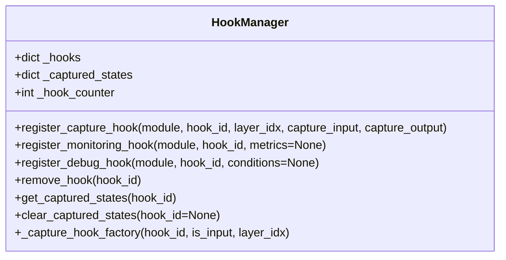

# HookManager

## Overview

`HookManager` is a utility class that provides comprehensive hook management for capturing and manipulating intermediate states in transformer models. It serves as a central point for managing all hook-related operations in the CMR system.

## Key Features

- **Flexible Hook Registration**: Register hooks on any module or layer
- **Multiple Hook Types**: Support for capture, monitoring, and debug hooks
- **Efficient State Management**: Handles state storage and retrieval
- **Thread-Safe Operations**: Safe for use in multi-threaded environments
- **Memory Management**: Automatic cleanup of captured states

## Architecture



## Usage Example

```python
from utils.hooks import HookManager
import torch.nn as nn

# Initialize hook manager
hook_manager = HookManager()

# Example transformer layer (replace with actual model layer)
transformer_layer = nn.TransformerEncoderLayer(d_model=512, nhead=8)

# Register a capture hook
hook_id = hook_manager.register_capture_hook(
    module=transformer_layer,
    hook_id="encoder_layer_4",
    layer_idx=4,
    capture_input=True,
    capture_output=True
)

# During model execution, states will be captured
# ...

# Retrieve captured states
captured = hook_manager.get_captured_states(hook_id)
print(f"Captured states: {len(captured)}")

# Cleanup when done
hook_manager.remove_hook(hook_id)
```

## Core Methods

- `register_capture_hook(module, hook_id, layer_idx, capture_input=True, capture_output=True)`: Registers a hook to capture layer states
- `register_monitoring_hook(module, hook_id, metrics=None)`: Registers a hook for monitoring layer metrics
- `register_debug_hook(module, hook_id, conditions=None)`: Registers a debug hook with optional conditions
- `remove_hook(hook_id)`: Removes a registered hook
- `get_captured_states(hook_id)`: Retrieves states captured by a specific hook
- `clear_captured_states(hook_id=None)`: Clears captured states for a hook or all hooks

## Hook Types

1. **Capture Hooks**
   - Capture input/output tensors from layers
   - Support for selective layer capture
   - Configurable capture behavior

2. **Monitoring Hooks**
   - Track layer statistics (mean, std, etc.)
   - Performance metrics collection
   - Resource usage monitoring

3. **Debug Hooks**
   - Conditional breakpoints
   - Tensor inspection
   - Gradient flow analysis

## Configuration

Configure using the following parameters:

- `max_captured_states`: Maximum number of states to keep in memory
- `cleanup_interval`: How often to clean up old states
- `memory_limit_mb`: Memory limit for captured states
- `enable_intervention`: Whether to allow state modification

## Best Practices

- Always remove hooks when they're no longer needed
- Be mindful of memory usage when capturing large tensors
- Use unique and descriptive hook IDs
- Consider the performance impact of hooks in production
- Implement proper error handling for hook callbacks
