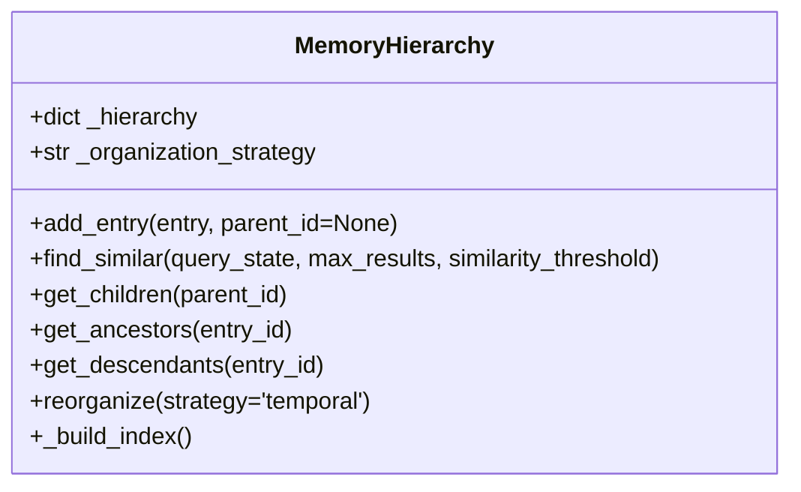

# MemoryHierarchy

## Overview
`MemoryHierarchy` is a planned utility class designed to organize and manage memory entries in a hierarchical structure. It will provide efficient organization and retrieval of memories based on various criteria such as temporal relationships, semantic similarity, and task-specific groupings.

## Key Features (Planned)
- **Hierarchical Organization**: Multi-level memory structuring
- **Efficient Retrieval**: Fast lookups using multiple indexing strategies
- **Dynamic Restructuring**: Adaptive hierarchy based on usage patterns
- **Task-Specific Grouping**: Support for different memory organizations per task
- **Scalable Storage**: Efficient handling of large numbers of memory entries

## Proposed Architecture


## Usage Example (Proposed)
```python
from utils.memory_hierarchy import MemoryHierarchy
import numpy as np

# Initialize memory hierarchy
hierarchy = MemoryHierarchy(organization_strategy='semantic')

# Add memory entries
entry1 = {
    'id': 'mem1',
    'embedding': np.random.rand(768),
    'timestamp': '2025-08-11T10:00:00',
    'metadata': {'task': 'conversation', 'importance': 0.8}
}
hierarchy.add_entry(entry1)

# Find similar memories
query_embedding = np.random.rand(768)
similar_memories = hierarchy.find_similar(
    query_state=query_embedding,
    max_results=5,
    similarity_threshold=0.7
)

# Reorganize hierarchy based on different criteria
hierarchy.reorganize(strategy='temporal')
```

## Core Methods (Planned)
- `add_entry(entry, parent_id=None)`: Adds a memory entry to the hierarchy
- `find_similar(query_state, max_results=10, similarity_threshold=0.5)`: Finds similar memories
- `get_children(parent_id)`: Retrieves child entries of a parent node
- `get_ancestors(entry_id)`: Gets all ancestor entries
- `get_descendants(entry_id)`: Retrieves all descendant entries
- `reorganize(strategy)`: Reorganizes the hierarchy based on the specified strategy
- `_build_index()`: Internal method to rebuild search indices

## Organization Strategies
1. **Temporal**: Organize memories based on time
2. **Semantic**: Group by content similarity
3. **Task-Based**: Organize by task or context
4. **Hybrid**: Combine multiple strategies

## Configuration (Planned)
- `organization_strategy`: Primary strategy for memory organization
- `max_levels`: Maximum depth of the hierarchy
- `reorganization_interval`: How often to reorganize the hierarchy
- `similarity_metric`: Distance metric for semantic organization

## Best Practices (Planned)
- Choose organization strategy based on access patterns
- Monitor hierarchy depth for performance
- Consider implementing incremental reorganization
- Cache frequently accessed branches
- Implement efficient serialization for persistence
