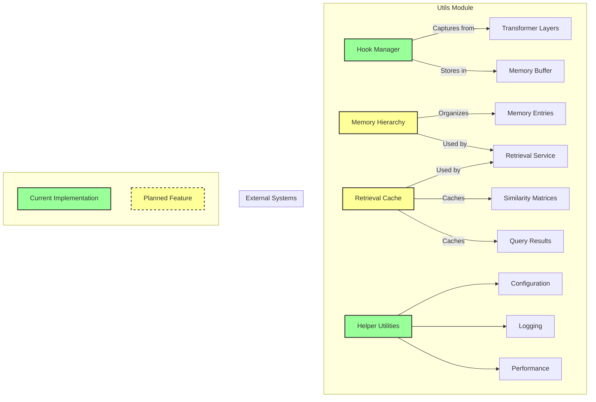

# Utils Module

The utils module contains utility classes and helper functionality for the Contextual Memory Reweaving (CMR) system. This module provides essential infrastructure components including hook management, memory organization utilities, and caching systems.

## Overview

The utils module provides foundational utilities that support the core CMR functionality. It includes hook management for capturing intermediate states, memory hierarchy organization, retrieval caching utilities, and other helper functions that enable efficient system operation.

## Table of Contents

- [Overview](#overview)
- [Key Components](#key-components)
- [Hook Management Details](#hook-management-details)
- [Memory Organization](#memory-organization)
- [Configuration](#configuration)
- [Performance Considerations](#performance-considerations)
- [Best Practices](#best-practices)
- [Troubleshooting](#troubleshooting)
- [Integration with CMR System](#integration-with-cmr-system)

### Architecture Relationships



**Key Components:**

1. **Hook Manager** (Current)
   - Captures hidden states from transformer layers
   - Manages hook lifecycle and state storage

2. **Memory Hierarchy** (Planned)
   - Organizes memory entries for efficient retrieval
   - Supports hierarchical memory organization

3. **Retrieval Cache** (Planned)
   - Caches similarity computations
   - Stores query results for faster access

4. **Helper Utilities** (Current)
   - Configuration management
   - Logging and monitoring
   - Performance profiling

## Key Components

### Hook Manager (`hooks.py`)

[View Class Documentation](./hooks.md)

The `HookManager` class provides comprehensive hook management for capturing intermediate transformer states:

**Core Features:**

- **Forward Hook Registration**: Register hooks on transformer layers
- **State Capture**: Capture hidden states during forward passes
- **Hook Lifecycle Management**: Manage hook creation, activation, and cleanup
- **Memory Management**: Efficient storage and retrieval of captured states
- **Error Handling**: Robust error handling for hook operations

**Hook Types:**

- **Capture Hooks**: Capture intermediate hidden states
- **Monitoring Hooks**: Monitor layer activations and performance
- **Debug Hooks**: Debugging and diagnostic hooks

**Usage Example:**

```python
from utils.hooks import HookManager

# Initialize hook manager
hook_manager = HookManager()

# Register capture hook on transformer layer
hook_id = hook_manager.register_capture_hook(
    module=transformer_layer,
    hook_id="layer_4_capture",
    layer_idx=4
)

# Process input (hooks will capture states automatically)
outputs = model(input_ids)

# Retrieve captured data
captured_data = hook_manager.get_captured_data("layer_4_capture")

# Cleanup hooks
hook_manager.remove_hooks()
```

**Key Methods:**

- `register_capture_hook()`: Register state capture hooks
- `get_captured_data()`: Retrieve captured states
- `remove_hooks()`: Clean up registered hooks
- `get_memory_usage()`: Monitor hook memory usage

### Memory Hierarchy Utilities

[View Planned Implementation Details](./memory_hierarchy.md)

Status: The memory hierarchy utilities described here are planned; there is no MemoryHierarchy implementation in the codebase today. The notes below are conceptual.

**Hierarchy Features:**

- **Clustering Algorithms**: Group similar memories together
- **Tree-based Organization**: Hierarchical memory structure
- **Efficient Traversal**: Fast memory search and retrieval
- **Dynamic Reorganization**: Adaptive hierarchy restructuring
- **Memory Locality**: Optimize for memory access patterns

**Organization Strategies:**

- **Content-based Clustering**: Group by semantic similarity
- **Temporal Clustering**: Group by time-based patterns
- **Layer-based Organization**: Organize by transformer layer
- **Task-specific Hierarchies**: Specialized organization for tasks

**Usage Example:**

```python
from models.advanced_retrieval import MemoryHierarchy

# Initialize memory hierarchy
hierarchy = MemoryHierarchy(
    hidden_size=768,
    max_clusters=32,
    clustering_method='kmeans'
)

# Add memories to hierarchy
hierarchy.add_memory(memory_entry)

# Retrieve similar memories
similar_memories = hierarchy.find_similar(
    query_state=current_state,
    max_results=10,
    similarity_threshold=0.7
)
```

### Retrieval Cache Utilities

[View Planned Implementation Details](./retrieval_cache.md)

Status: The retrieval cache utilities described here are planned; there is no RetrievalCache implementation in the codebase today. The notes below are conceptual.

**Caching Features:**

- **LRU Cache Management**: Least Recently Used eviction policy
- **Multi-level Caching**: Hierarchical cache structure
- **Cache Hit Optimization**: Maximize cache hit rates
- **Memory-efficient Storage**: Optimize cache memory usage
- **Cache Statistics**: Track cache performance metrics

**Cache Types:**

- **Query Result Cache**: Cache retrieval results
- **Similarity Cache**: Cache similarity computations
- **Ranking Cache**: Cache ranking results
- **Computation Cache**: Cache expensive computations

**Usage Example:**

```python
from models.advanced_retrieval import RetrievalCache

# Initialize retrieval cache
cache = RetrievalCache(
    cache_size=1000,
    eviction_policy='lru'
)

# Check cache for query
cache_key = generate_cache_key(query_params)
cached_result = cache.get(cache_key)

if cached_result is None:
    # Compute result and cache it
    result = expensive_computation(query_params)
    cache.put(cache_key, result)
    return result
else:
    return cached_result
```

### Helper Functions and Utilities

The utils module includes various helper functions:

**Tensor Utilities:**

- Tensor shape manipulation
- Efficient tensor operations
- Memory-efficient tensor storage
- Tensor serialization and deserialization

**Configuration Utilities:**

- Configuration validation
- Default configuration management
- Configuration merging and inheritance
- Environment-based configuration

**Logging Utilities:**

- Structured logging for CMR components
- Performance logging
- Debug logging with context
- Log aggregation and analysis

## Hook Management Details

### Hook Registration Process

**Registration Steps:**

1. **Module Identification**: Identify target transformer module
2. **Hook Function Creation**: Create appropriate hook function
3. **Hook Registration**: Register hook with PyTorch module
4. **Metadata Storage**: Store hook configuration and metadata
5. **Activation Tracking**: Track hook activation and performance

### Hook Function Types

**Capture Hook Function:**

```python
def capture_hook_fn(module, input, output):
    """Capture hidden states during forward pass."""
    # Extract hidden states from output
    hidden_states = output[0] if isinstance(output, tuple) else output

    # Store captured states with metadata
    hook_manager.store_captured_state(
        hook_id=hook_id,
        hidden_states=hidden_states,
        layer_idx=layer_idx,
        timestamp=time.time()
    )
```

**Intervention Hook Function:**

```python
def intervention_hook_fn(module, input, output):
    """Modify hidden states during forward pass."""
    # Get original hidden states
    hidden_states = output[0] if isinstance(output, tuple) else output

    # Apply memory-enhanced modifications
    enhanced_states = apply_memory_enhancement(
        hidden_states=hidden_states,
        retrieved_memories=relevant_memories,
        integration_method='weighted_sum'
    )

    # Return modified output
    if isinstance(output, tuple):
        return (enhanced_states,) + output[1:]
    else:
        return enhanced_states
```

### Hook Performance Optimization

**Optimization Strategies:**

- **Selective Hook Activation**: Activate hooks only when needed
- **Efficient State Storage**: Optimize memory usage for captured states
- **Batch Hook Processing**: Process multiple hooks efficiently
- **Hook Caching**: Cache hook results for repeated operations

## Memory Organization

### Hierarchical Memory Structure

**Tree Structure:**

```text
Memory Hierarchy Root (Conceptual)
├── Cluster 1 (Semantic Group A)
│   ├── Layer 4 Memories
│   ├── Layer 6 Memories
│   └── Layer 8 Memories
├── Cluster 2 (Semantic Group B)
│   ├── Layer 4 Memories
│   └── Layer 6 Memories
└── Cluster 3 (Semantic Group C)
    ├── Layer 6 Memories
    └── Layer 8 Memories
```

### Clustering Algorithms

**Supported Algorithms:**

- **K-means Clustering**: Partition memories into k clusters
- **Hierarchical Clustering**: Build tree-based memory hierarchy
- **DBSCAN**: Density-based clustering for irregular shapes
- **Spectral Clustering**: Graph-based clustering approach

### Memory Access Patterns

**Optimization for Access Patterns:**

- **Spatial Locality**: Group related memories together
- **Temporal Locality**: Organize by access time patterns
- **Semantic Locality**: Group semantically similar memories
- **Layer Locality**: Organize by transformer layer

## Configuration

### Hook Manager Configuration

```python
hook_config = {
    'max_captured_states': 10000,        # Maximum captured states
    'cleanup_interval': 100,             # Cleanup interval
    'memory_limit_mb': 500,              # Memory limit for hooks
    'enable_intervention': True,         # Enable intervention hooks
    'capture_gradients': False,          # Capture gradient information
    'hook_timeout': 1.0                  # Hook execution timeout
}
```

### Memory Hierarchy Configuration

```python
hierarchy_config = {
    'max_clusters': 32,                  # Maximum number of clusters
    'clustering_method': 'kmeans',       # Clustering algorithm
    'max_depth': 4,                      # Maximum hierarchy depth
    'min_cluster_size': 10,              # Minimum cluster size
    'similarity_threshold': 0.7,         # Similarity threshold
    'rebalance_interval': 1000           # Rebalancing interval
}
```

### Cache Configuration

```python
cache_config = {
    'cache_size': 1000,                  # Maximum cache entries
    'eviction_policy': 'lru',            # Cache eviction policy
    'hit_rate_target': 0.8,              # Target cache hit rate
    'memory_limit_mb': 100,              # Cache memory limit
    'enable_compression': True,          # Enable cache compression
    'cleanup_interval': 60.0             # Cache cleanup interval
}
```

## Performance Considerations

### Memory Management

**Memory Optimization:**

- **Efficient Storage**: Use memory-efficient data structures
- **Garbage Collection**: Regular cleanup of unused objects
- **Memory Pooling**: Reuse memory allocations
- **Compression**: Compress stored data when appropriate

### Computational Efficiency

**Performance Optimization:**

- **Vectorized Operations**: Use vectorized computations
- **Batch Processing**: Process multiple items together
- **Caching**: Cache expensive computations
- **Lazy Evaluation**: Compute results only when needed

## Best Practices

### Hook Management

1. **Proper Cleanup**: Always clean up hooks after use
2. **Memory Monitoring**: Monitor hook memory usage
3. **Error Handling**: Implement robust error handling
4. **Performance Impact**: Minimize hook performance overhead

### Memory Organization Best Practices

1. **Appropriate Clustering**: Choose suitable clustering parameters
2. **Regular Maintenance**: Perform regular hierarchy maintenance
3. **Access Pattern Optimization**: Optimize for your access patterns
4. **Memory Limits**: Set appropriate memory limits

### Caching

1. **Cache Size Tuning**: Tune cache size for your workload
2. **Hit Rate Monitoring**: Monitor and optimize cache hit rates
3. **Eviction Policy**: Choose appropriate eviction policies
4. **Cache Warming**: Pre-populate cache with likely queries

## Troubleshooting

### Common Issues

- **Memory Leaks**: Ensure proper hook cleanup
- **Performance Degradation**: Monitor hook overhead
- **Cache Misses**: Optimize cache configuration
- **Clustering Issues**: Tune clustering parameters

### Performance Tips

- Use appropriate data structures for your use case
- Monitor memory usage and performance regularly
- Implement efficient cleanup procedures
- Optimize for your specific access patterns

## Integration with CMR System

### Seamless Integration

The utils module integrates with all CMR components:

**Integration Points:**

- **Models**: Hook integration with transformer models
- **Memory Buffer**: Memory organization utilities
- **Retrieval System**: Caching and hierarchy utilities
- **Monitoring**: Performance tracking utilities

### Utility APIs

**Standardized Interfaces:**

- Consistent utility APIs across components
- Configurable utility parameters
- Error handling and logging integration
- Performance monitoring capabilities
